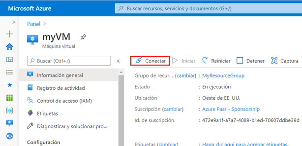
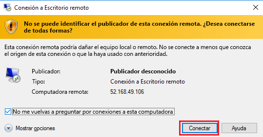
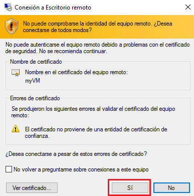
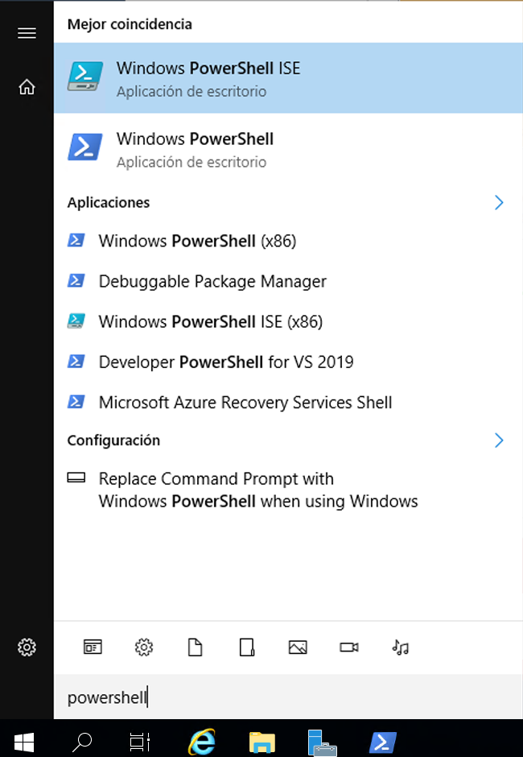
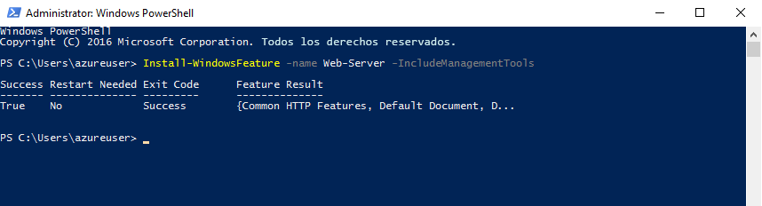
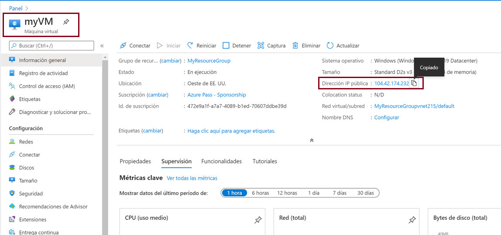
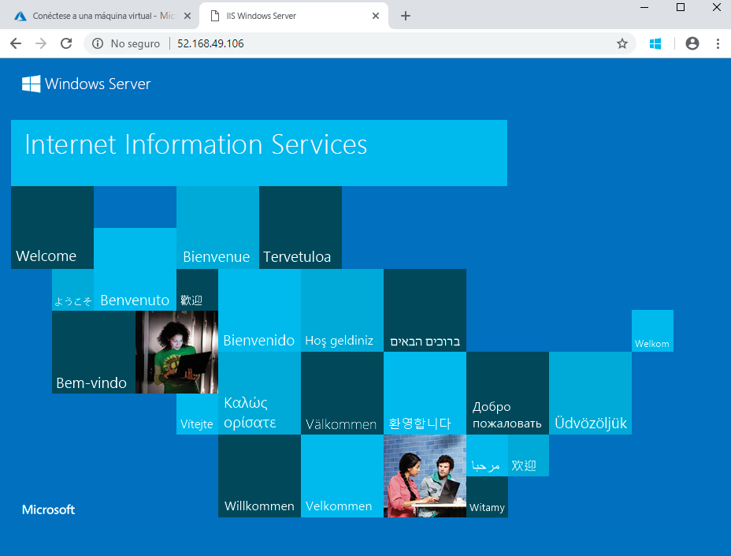

---
wts:
  title: "01: Crear una máquina virtual en el portal (10\_minutos)"
  module: Module 02 - Core Azure Services (Workloads)
---
# <a name="01---create-a-virtual-machine-in-the-portal-10-min"></a>01: Crear una máquina virtual en el portal (10 minutos)

En este tutorial crearemos una máquina virtual en Azure Portal, nos conectaremos a esa máquina virtual, instalaremos el rol de servidor web y la probaremos. 

**Nota**: Tómese el tiempo durante este tutorial para hacer clic y leer los iconos informativos. 

# <a name="task-1-create-the-virtual-machine"></a>Tarea 1: Creación de la máquina virtual 
1. Inicie sesión en Azure Portal: **https://portal.azure.com**

3. En la hoja **Todos los servicios** del menú Portal, busque y seleccione **Máquinas virtuales**, luego haga clic en **+Crear** y seleccione **+Máquina virtual de Azure** en el menú desplegable.

4. En la pestaña **Datos básicos**, complete la siguiente información (deje los valores predeterminados para todo lo demás):

    | Configuración | Valores |
    |  -- | -- |
    | Subscription | **Usar los valores predeterminados** |
    | Grupo de recursos | **Crear un grupo de recursos** |
    | Nombre de la máquina virtual | **myVM** |
    | Region | **(EE. UU.) Este de EE. UU.**|
    | Opciones de disponibilidad | No se necesitan opciones de redundancia de la infraestructura|
    | Imagen | **Windows Server 2019 Datacenter - Gen2**|
    | Size | **Estándar D2s v3**|
    | Nombre de usuario de la cuenta de administrador | **azureuser** |
    | Contraseña de la cuenta de administrador (escríbala cuidadosamente) | **Pa$$w0rd1234**|
    | Reglas de puerto de entrada - | **Permitir los puertos seleccionados**|
    | Selección de puertos de entrada | **RDP (3389)** y **HTTP (80)**| 

5. Vaya a la pestaña Redes para asegurarse de que **HTTP (80) y RDP (3389)** están seleccionados en la sección **Seleccionar puertos de entrada**.

6. Vaya a la pestaña Administración y, en la sección **Supervisión**, seleccione la siguiente configuración:

    | Configuración | Valores |
    | -- | -- |
    | Diagnósticos de arranque | **Deshabilitar**|

7. Deje los valores predeterminados restantes y luego haga clic en el botón **Revisar y crear** en la parte inferior de la página.

8. Once Validation is passed click the <bpt id="p1">**</bpt>Create<ept id="p1">**</ept> button. It can take anywhere from five to seven minutes to deploy the virtual machine.

9. Recibirá actualizaciones en la página de implementación y a través del área **Notificaciones** (el icono en forma de campana de la barra de menús superior).

# <a name="task-2-connect-to-the-virtual-machine"></a>Tarea 2: Conexión a la máquina virtual

En esta tarea nos conectaremos a nuestra nueva máquina virtual usando el RDP (el Protocolo de escritorio remoto). 

1. Haga clic en el icono en forma de campana que aparece en la barra de herramientas azul de la parte superior y seleccione "Ir al recurso" cuando la implementación se haya completado con éxito. 

    **Nota**: También puede usar el vínculo **Ir al recurso** de la página de implementación. 

2. En la hoja **Información general** de la máquina virtual, haga clic en el botón **Conectar** y seleccione **RDP** en el menú desplegable.

    

    <bpt id="p1">**</bpt>Note<ept id="p1">**</ept>: The following directions tell you how to connect to your VM from a Windows computer. On a Mac, you need an RDP client such as this Remote Desktop Client from the Mac App Store and on a Linux computer you can use an open source RDP client.

2. On the <bpt id="p1">**</bpt>Connect to virtual machine<ept id="p1">**</ept> page, keep the default options to connect with the public IP address over port 3389 and click <bpt id="p2">**</bpt>Download RDP File<ept id="p2">**</ept>. A file will download on the bottom left of your screen.

3. **Abra** el archivo RDP descargado (ubicado en la parte inferior izquierda de la máquina de su laboratorio) y haga clic en **Conectar** cuando se le pida. 

    

4. En la ventana **Seguridad de Windows**, inicie sesión con las credenciales de administrador que utilizó al crear el usuario **azureuser** y la contraseña **Pa$$w0rd1234** de la máquina virtual. 

5. You may receive a warning certificate during the sign-in process. Click <bpt id="p1">**</bpt>Yes<ept id="p1">**</ept> or to create the connection and connect to your deployed VM. You should connect successfully.

    

A new Virtual Machine (myVM) will launch inside your Lab. Close the Server Manager and dashboard windows that pop up (click "x" at top right). You should see the blue background of your virtual machine. <bpt id="p1">**</bpt>Congratulations!<ept id="p1">**</ept> You have deployed and connected to a Virtual Machine running Windows Server. 

# <a name="task-3-install-the-web-server-role-and-test"></a>Tarea 3: Instalar el rol del servidor web y probarlo

En esta tarea, instale el rol Servidor web en el servidor de la máquina virtual que acaba de crear y asegúrese de que se mostrará la página principal predeterminada de IIS. 

1. En la máquina virtual que acaba de abrir, inicie PowerShell. Para ello, busque **PowerShell** en la barra de búsqueda y, cuando lo encuentre, haga clic con el botón derecho en **Windows PowerShell** y luego en la opción **Ejecutar como administrador**.

    

2. In PowerShell, install the <bpt id="p1">**</bpt>Web-Server<ept id="p1">**</ept> feature on the virtual machine by running the following command. (Paste in the command and hit ENTER for the installment to begin).

    ```PowerShell
    Install-WindowsFeature -name Web-Server -IncludeManagementTools
    ```
  
3. When completed, a prompt will state <bpt id="p1">**</bpt>Success<ept id="p1">**</ept> with a value <bpt id="p2">**</bpt>True<ept id="p2">**</ept>. You do not need to restart the virtual machine to complete the installation. Close the RDP connection to the VM by clicking the <bpt id="p1">**</bpt>x<ept id="p1">**</ept> on the blue bar at the top center of your virtual machine. You can also minimize it by clicking the <bpt id="p1">**</bpt><ph id="ph1">-</ph><ept id="p1">**</ept> on the blue bar at the top center.

    

4. De vuelta en el portal, navegue hasta la hoja **Información general** de MiVM y use el botón **Clic para copiar al Portapapeles** para copiar la dirección IP pública de MiVM. Abra una nueva pestaña del explorador, pegue la dirección IP pública en el cuadro de texto de URL y pulse la tecla **Entrar** para acceder a ella.

    

5. Se abrirá la página principal predeterminada del servidor web IIS.

    

<bpt id="p1">**</bpt>Congratulations!<ept id="p1">**</ept> You have created a new VM running a web server that is accessible via its public IP address. If you had a web application to host, you could deploy application files to the virtual machine and host them for public access on the deployed virtual machine.


<bpt id="p1">**</bpt>Note<ept id="p1">**</ept>: To avoid additional costs, you can optionally remove this resource group. Search for resource groups, click your resource group, and then click <bpt id="p1">**</bpt>Delete resource group<ept id="p1">**</ept>. Verify the name of the resource group and then click <bpt id="p1">**</bpt>Delete<ept id="p1">**</ept>. Monitor the <bpt id="p1">**</bpt>Notifications<ept id="p1">**</ept> to see verify that the deletion completed successfully. 
