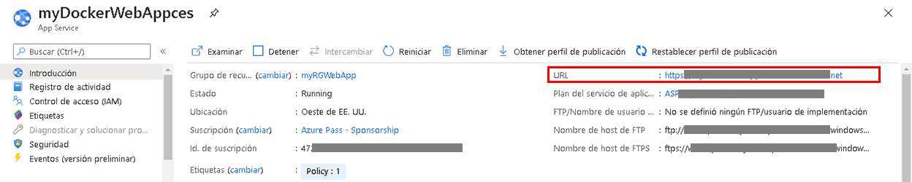
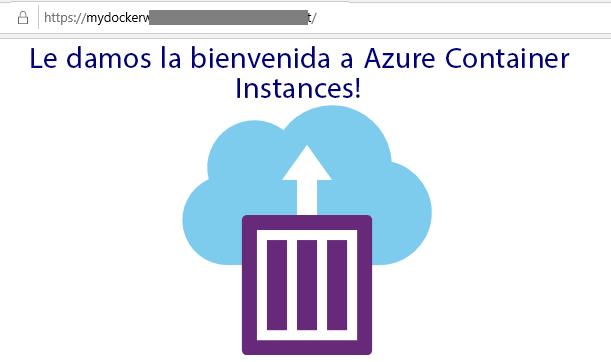

---
wts:
  title: "2: Crear una aplicación web (10\_minutos)"
  module: Module 02 - Core Azure Services (Workloads)
---
# 2: Crear una aplicación web (10 minutos)

In this walkthrough, we will create a web app that runs a Docker container. The Docker container contains a Welcome message. 

Azure App Service are actually a collection of four services, all of which are built to help you host and run web applications. The four services (Web Apps, Mobile Apps, API Apps, and Logic Apps) look different, but in the end they all operate in very similar ways. Web Apps are the most commonly used of the four services, and this is the service that we will be using in this lab.

# Tarea 1: Creación de una aplicación web 

En esta tarea, creará una aplicación web de Azure App Service. 

1. Inicie sesión en el [Portal de Azure](http://portal.azure.com/). 

2. Desde la hoja **Todos los servicios**, busque y seleccione **App Services** y haga clic en **+ Agregar, + Crear, o + Nuevo**.

3. On the <bpt id="p1">**</bpt>Basics<ept id="p1">**</ept> tab of the <bpt id="p2">**</bpt>Web App<ept id="p2">**</ept> blade, specify the following settings (replace <bpt id="p3">**</bpt>xxxx<ept id="p3">**</ept> in the name of the web app with letters and digits such that the name is globally unique). Leave the defaults for everything else, including the App Service Plan. 

    | Configuración | Valor |
    | -- | -- |
    | Subscription | **Usar los valores predeterminados** |
    | Grupo de recursos | **Crear un grupo de recursos**|
    | Nombre | **myDockerWebAppxxxx** |
    | Publicar | **Contenedor de Docker** |
    | Sistema operativo | **Linux** |
    | Region | **Este de EE. UU.** |
    
    **Nota:** Recuerde reemplazar **xxxx** para que el nombre de su aplicación web sea único.

4. Haga clic en **Siguiente > Docker** y configure la información del contenedor.  

    | Configuración | Valor |
    | -- | -- |
    | Opciones | **Contenedor individual** |
    | Origen de la imagen | **Docker Hub** |
    | Tipo de acceso | **Public** |
    | Image and tag (Imagen y etiqueta) | **mcr.microsoft.com/azuredocs/aci-helloworld** |
    
 **Nota:** El comando de inicio es opcional y no es necesario en este ejercicio.

5. Haga clic en **Revisar y crear** y después en **Crear**. 

# Tarea 2: Prueba de la aplicación web

En esta tarea probaremos la aplicación web.

1. Espere a que se implemente la aplicación web.

2. Desde **Notificaciones**, haga clic en **Ir al recurso**. 

3. En este tutorial, crearemos una nueva aplicación web que ejecute un contenedor de Docker.

    

4. In a new browser window, paste the URl and press enter. The Welcome to Azure Container Instances! welcome message will be displayed.

    

5. Azure App Service es en realidad una colección de cuatro servicios, los cuales están diseñados para hospedar y ejecutar aplicaciones web. 

Los cuatro servicios (Web Apps, Mobile Apps, API Apps y Logic Apps) parecen diferentes, pero, al final, todos funcionan de manera muy similar.

Enhorabuena. Acaba de crear con éxito una aplicación de Azure App Service.
