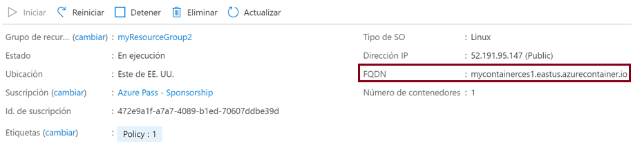
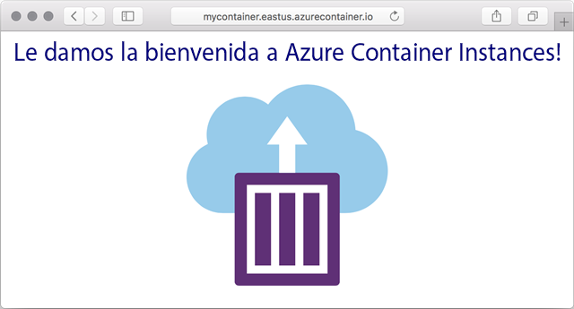

---
wts:
  title: "3: Implementar Azure\_Container\_Instances (10\_minutos)"
  module: Module 02 - Core Azure Services (Workloads)
---

# 3: Implementar Azure Container Instances (10 minutos)

In this walkthrough we create, configure, and deploy a container by using Azure Container Instances (ACI) in the Azure Portal. The container is a Welcome to ACI web application that displays a static HTML page. 

# Tarea 1: Creación de una instancia de contenedor 

En esta tarea, se creará una instancia de contenedor para la aplicación web.  

1. Inicie sesión en [Azure Portal](https://portal.azure.com).

2. Desde la hoja **Todos los servicios**, busque y seleccione **Container instances** y haga clic en **+ Agregar, + Crear, o + Nuevo**. 

3. Dé los siguientes detalles básicos para la nueva instancia de contenedor (deje los valores predeterminados para todo lo demás): 

    | Configuración| Value|
    |----|----|
    | Subscription | ***Usar los valores predeterminados*** |
    | Grupo de recursos | **Crear un grupo de recursos** |
    | Nombre del contenedor| **mycontainer**|
    | Region | **(EE. UU.) Este de EE. UU.** |
    | Origen de la imagen| **Docker Hub u otro registro**|
    | Tipo de imagen| **Public**|
    | Imagen| **mcr.microsoft.com/azuredocs/aci-helloworld**|
    | Tipo de SO| **Linux** |
    | Size| ***Deje la opción predeterminada.***|

4. Configure the Networking tab (replace <bpt id="p1">**</bpt>xxxxx<ept id="p1">**</ept> with letters and digits such that the name is globally unique). Leave all other settings at their default values.

    | Configuración| Value|
    |--|--|
    | Etiqueta de nombre DNS| **mycontainerdnsxxxxx** |

    
    <bpt id="p1">**</bpt>Note<ept id="p1">**</ept>: Your container will be publicly reachable at dns-name-label.region.azurecontainer.io. If you receive a <bpt id="p1">**</bpt>DNS name label not available<ept id="p1">**</ept> error message following the deployment, specify a different DNS name label (replacing the xxxxx) and re-deploy. 

5. Haga clic en **Revisar y crear** para iniciar el proceso de validación automática.

6. Haga clic en **Crear** para crear la instancia de contenedor. 

7. Supervise la página de implementación y la de **Notificaciones**. 

# Tarea 2: Comprobación de la implementación de la instancia de contenedor

En esta tarea, se comprobará que la instancia del contenedor está en ejecución, asegurándose de que se muestre la página principal.

1. Una vez completada la implementación, haga clic en el vínculo **Ir al recurso** en la hoja de implementación o el vínculo al recurso en el área de notificación.

2. En la hoja **Visión general** de **mycontainer**, asegúrese de que el **Estado** de su contenedor esté **ejecutándose**. 

3. Localice el nombre de dominio completo (FQDN).

    

2. En este tutorial crearemos, configuramos e implementamos un contenedor mediante Azure Container Instances (ACI) en Azure Portal. 

    

El contenedor es una aplicación web Bienvenido a ACI que muestra una página HTML estática.

<bpt id="p1">**</bpt>Note<ept id="p1">**</ept>: To avoid additional costs, you can optionally remove this resource group. Search for resource groups, click your resource group, and then click <bpt id="p1">**</bpt>Delete resource group<ept id="p1">**</ept>. Verify the name of the resource group and then click <bpt id="p1">**</bpt>Delete<ept id="p1">**</ept>. Monitor the <bpt id="p1">**</bpt>Notifications<ept id="p1">**</ept> to see how the delete is proceeding.
