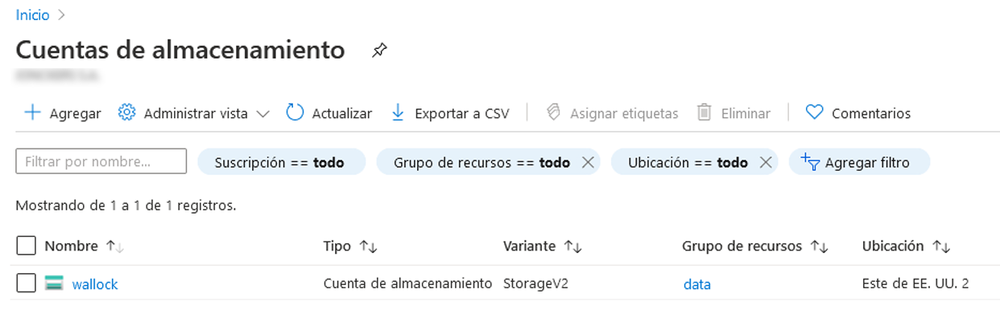
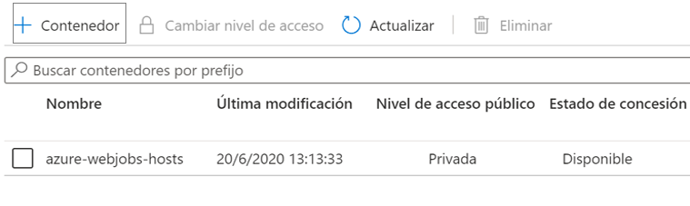

---
wts:
  title: "5: Crear un almacenamiento de blobs (5\_minutos)"
  module: Module 02 - Core Azure Services (Workloads)
---
# 5: Crear un almacenamiento de blobs (5 minutos)

En este tutorial, crearemos una cuenta de almacenamiento y luego trabajaremos con archivos de almacenamiento de blobs.

# Tarea 1: Creación de una cuenta de almacenamiento 

En esta tarea crearemos una nueva cuenta de almacenamiento. 

1. Inicie sesión en Azure Portal en <a href="https://portal.azure.com" target="_blank">https://portal.azure.com</a>

2. Desde la hoja **Todos los servicios**, busque y seleccione **Cuentas de almacenamiento** y luego haga clic en **+ Agregar, + Crear, o + Nuevo**. 

3. On the <bpt id="p1">**</bpt>Basics<ept id="p1">**</ept> tab of the <bpt id="p2">**</bpt>Create storage account<ept id="p2">**</ept> blade, fill in the following information (replace <bpt id="p3">**</bpt>xxxx<ept id="p3">**</ept> in the name of the storage account with letters and digits such that the name is globally unique). Leave the defaults for everything else.

    | Configuración | Valor | 
    | --- | --- |
    | Subscription | **Deje el valor predeterminado** |
    | Grupo de recursos | **Crear un grupo de recursos** |
    | Nombre de la cuenta de almacenamiento | **storageaccountxxxxx** |
    | Location | **(EE. UU.) Este de EE. UU.**  |
    | Rendimiento | **Estándar** |
    | Redundancia | **Almacenamiento con redundancia local (LRS)** |
    
    **Nota**: Recuerde cambiar **xxxx** de modo que sea un **nombre de cuenta de almacenamiento** único.

5. Haga clic en **Revisar y crear** para revisar la configuración de su cuenta de almacenamiento y permitir que Azure valide la configuración. 

6. Once validated, click <bpt id="p1">**</bpt>Create<ept id="p1">**</ept>. Wait for the notification that the account was successfully created. 

7. Desde la página de inicio, busque y seleccione **Cuentas de almacenamiento** y asegúrese de que su nueva cuenta de almacenamiento aparezca en la lista.

    

# Tarea 2: Trabaje con almacenamiento de blobs

En esta tarea, crearemos un contenedor de blobs y subiremos un archivo de blobs. 

1. Haga clic en el nombre de la nueva cuenta de almacenamiento, desplácese hasta la sección **Almacenamiento de datos** en el menú izquierdo y luego haga clic **Containers**.

2. Click <bpt id="p1">**</bpt>+ Container<ept id="p1">**</ept> and complete the information. Use the Information icons to learn more. When done click <bpt id="p1">**</bpt>Create<ept id="p1">**</ept>.

    | Configuración | Valor |
    | --- | --- |
    | Nombre | **Contenedor1**  |
    | Nivel de acceso público| **Privado (sin acceso anónimo)** |
  

    

4. Open a new browser window and search <bpt id="p1">**</bpt>Bing<ept id="p1">**</ept> for an image of a flower. Right click on the image and save it to your VM. 

6. Una vez vuelva a Portal, haga clic en **contenedor1** y luego seleccione **Cargar**.

5. Browse for the image file you just saved on your local computer. Select it and then select upload.

   
6. Haga clic en la flecha **Opciones avanzadas**; deje los valores predeterminados, pero revise las opciones disponibles, y luego haga clic en **Cargar**.

    <bpt id="p1">**</bpt>Note<ept id="p1">**</ept>: You can upload as many blobs as you like in this way. New blobs will be listed within the container.

7. Una vez que se carga el archivo, haga clic con el botón derecho en el archivo y observe las opciones que incluyen Ver/editar, Descargar, Propiedades y Eliminar. 

8. Si tiene tiempo, revise las opciones para Archivos, Tablas y Colas.

# Tarea 3: Supervisar la cuenta de almacenamiento

1. Regrese a la hoja de la cuenta de almacenamiento y haga clic en **Diagnosticar y resolver problemas**. 

2. Explore some of the most common storage problems. Notice there are multiple troubleshooters here.

3. On the storage account blade, scroll down to the <bpt id="p1">**</bpt>Monitoring<ept id="p1">**</ept> section and click <bpt id="p2">**</bpt>Insights<ept id="p2">**</ept>. Notice there is information on Failures, Performance, Availability, and Capacity. Your information will be different.

    

En la pestaña **Datos básicos** de la hoja **Crear cuenta de almacenamiento**, complete la siguiente información (reemplace **xxxx** en el nombre de la cuenta de almacenamiento con letras y dígitos de modo que el nombre sea único a nivel global).

Deje los valores predeterminados para todo lo demás.
