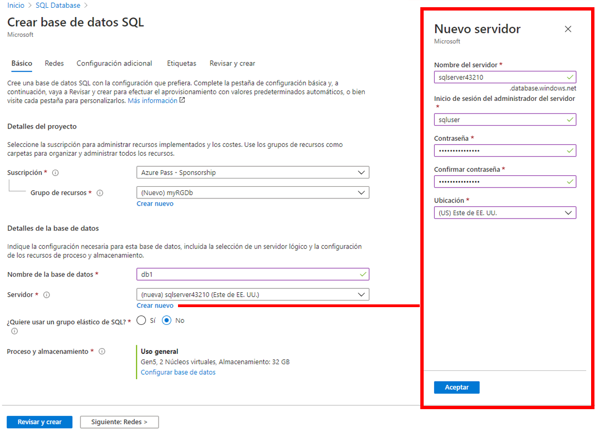
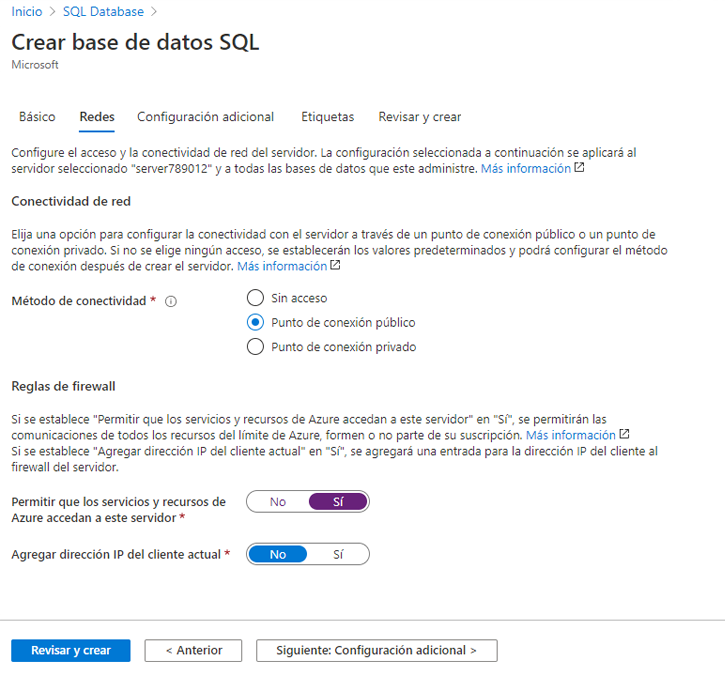
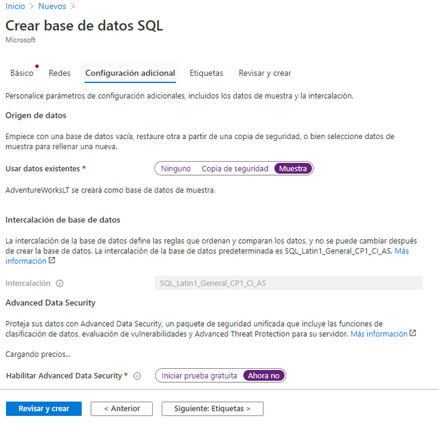
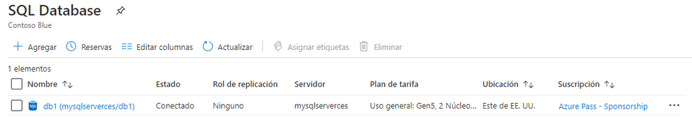
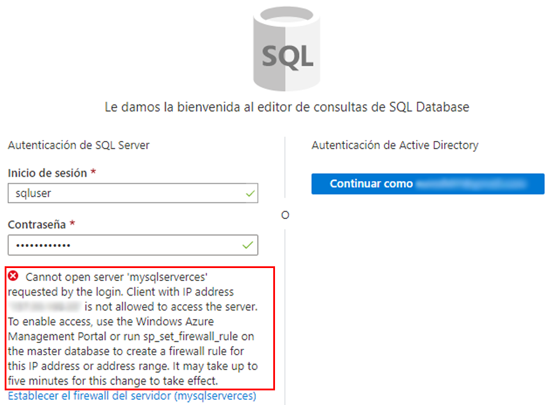
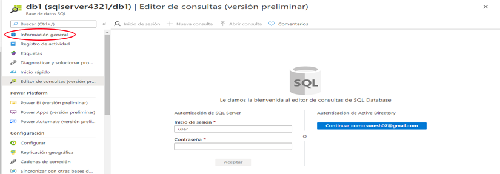
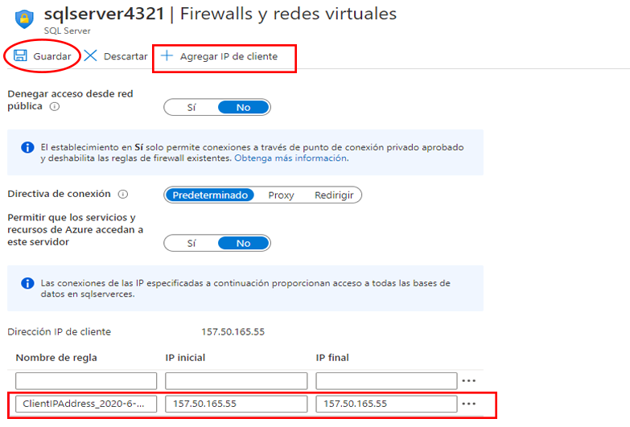

---
wts:
  title: "6: Crear una base de datos SQL (5\_minutos)"
  module: Module 02 - Core Azure Services (Workloads)
---

# <a name="06---create-a-sql-database-5-min"></a>6: Crear una base de datos SQL (5 minutos)

En este tutorial, crearemos una base de datos de SQL en Azure y luego consultaremos los datos de la base.

# <a name="task-1-create-the-database"></a>Tarea 1: Creación de la base de datos 

En esta tarea, crearemos una base de datos SQL basada en la base de datos de ejemplo AdventureWorksLT. 

1. Inicie sesión en Azure Portal en [ **https://portal.azure.com** ](https://portal.azure.com).

2. Desde la hoja **Todos los servicios**, busque y seleccione **Bases de datos SQL** y haga clic en **+ Agregar, + Crear, o + Nuevo**. 

3. En la pestaña **Aspectos básicos**, rellene esta información.  

    | Configuración | Valor | 
    | --- | --- |
    | Subscription | **Usar los valores predeterminados** |
    | Grupo de recursos | **Crear un grupo de recursos** |
    | Nombre de la base de datos| **bd1** | 
    | Servidor | Seleccione **Crear nuevo** (se abrirá una nueva barra lateral a la derecha)|
    | Nombre de servidor | **sqlserverxxxx** (debe ser único) | 
    | Location | **(EE. UU.) Este de EE. UU.** |
    | Método de autenticación | **Use la autenticación de SQL.** |
    | Inicio de sesión del administrador del servidor | **sqluser** |
    | Contraseña | **Pa$$w0rd1234** |
    | Haga clic en  | **OK (CORRECTO)** |

   

4. En la pestaña **Redes**, configure las siguientes opciones (deje las demás con los valores predeterminados): 

    | Configuración | Valor | 
    | --- | --- |
    | Método de conectividad | **Punto de conexión público** |    
    | Permitir que los servicios y recursos de Azure accedan a este servidor | **Sí** |
    | Agregar dirección IP del cliente actual | **No** |
    
   

5. Seleccione la pestaña **Seguridad**. 

    | Configuración | Value | 
    | --- | --- |
    | Microsoft Defender para SQL| **Ahora no** |
    
6. Vaya a la pestaña **Configuración adicional**. Utilizaremos la base de datos de muestra AdventureWorksLT.

    | Configuración | Value | 
    | --- | --- |
    | Usar datos existentes | **Ejemplo** |

    

7. Click <bpt id="p1">**</bpt>Review + create<ept id="p1">**</ept> and then click <bpt id="p2">**</bpt>Create<ept id="p2">**</ept> to deploy and provision the resource group, server, and database. It can take approx. 2 to 5 minutes to deploy.


# <a name="task-2-test-the-database"></a>Tarea 2: Probar la base de datos.

En esta tarea, configuraremos SQL Server y ejecutaremos una consulta SQL. 

1. When the deployment has completed, click Go to resource from the deployment blade. Alternatively, from the <bpt id="p1">**</bpt>All Resources<ept id="p1">**</ept> blade, search and select <bpt id="p2">**</bpt>Databases<ept id="p2">**</ept>, then <bpt id="p3">**</bpt>SQL databases<ept id="p3">**</ept> ensure your new database was created. You may need to <bpt id="p1">**</bpt>Refresh<ept id="p1">**</ept> the page.

    

2. Click the <bpt id="p1">**</bpt>db1<ept id="p1">**</ept> entry representing the SQL database you created. On the db1 blade click <bpt id="p1">**</bpt>Query editor (preview)<ept id="p1">**</ept>.

3. Inicie sesión como **sqluser** con la contraseña **Pa$$w0rd1234**.

4. You will not be able to login. Read the error closely and make note of the IP address that needs to be allowed through the firewall. 

    

5. En la hoja **bd1**, haga clic en **Información general**. 

    

6. En la hoja **Información general** de bd1, haga clic en **Establecer el firewall del servidor**, que se encuentra en la parte superior central de la pantalla Información general.

7. Click <bpt id="p1">**</bpt>+ Add client IP<ept id="p1">**</ept> (top menu bar) to add the IP address referenced in the error. (it may have autofilled for you - if not paste it into the IP address fields). Be sure to <bpt id="p1">**</bpt>Save<ept id="p1">**</ept> your changes. 

    

8. Return to your SQL database (slide the bottom toggle bar to the left) and click on <bpt id="p1">**</bpt>Query Editor (Preview)<ept id="p1">**</ept>. Try to login again as <bpt id="p1">**</bpt>sqluser<ept id="p1">**</ept> with the password <bpt id="p2">**</bpt>Pa$$w0rd1234<ept id="p2">**</ept>. This time you should succeed. Note that it may take a couple of minutes for the new firewall rule to be deployed. 

9. Once you log in successfully, the query pane appears. Enter the following query into the editor pane. 

    ```SQL
    SELECT TOP 20 pc.Name as CategoryName, p.name as ProductName
    FROM SalesLT.ProductCategory pc
    JOIN SalesLT.Product p
    ON pc.productcategoryid = p.productcategoryid;
    ```

    

10. Click <bpt id="p1">**</bpt>Run<ept id="p1">**</ept>, and then review the query results in the <bpt id="p2">**</bpt>Results<ept id="p2">**</ept> pane. The query should run successfully.

    

Congratulations! You have created a SQL database in Azure and successfully queried the data in that database.

<bpt id="p1">**</bpt>Note<ept id="p1">**</ept>: To avoid additional costs, you can optionally remove this resource group. Search for resource groups, click your resource group, and then click <bpt id="p1">**</bpt>Delete resource group<ept id="p1">**</ept>. Verify the name of the resource group and then click <bpt id="p1">**</bpt>Delete<ept id="p1">**</ept>. Monitor the <bpt id="p1">**</bpt>Notifications<ept id="p1">**</ept> to see how the delete is proceeding.
