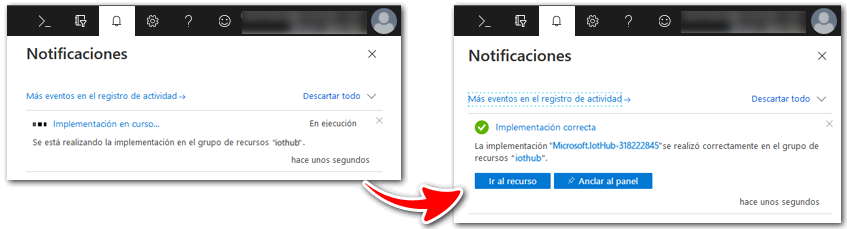
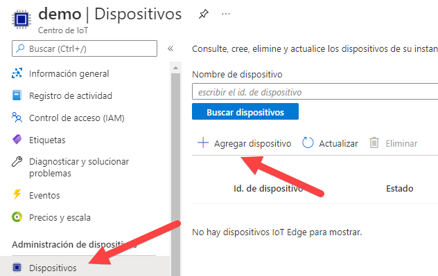
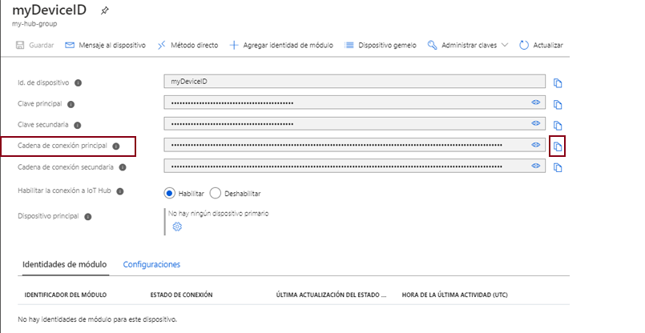
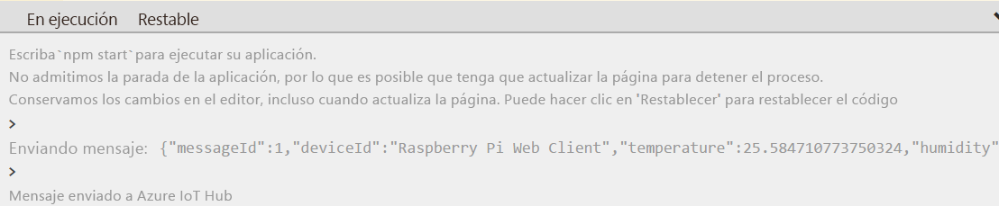
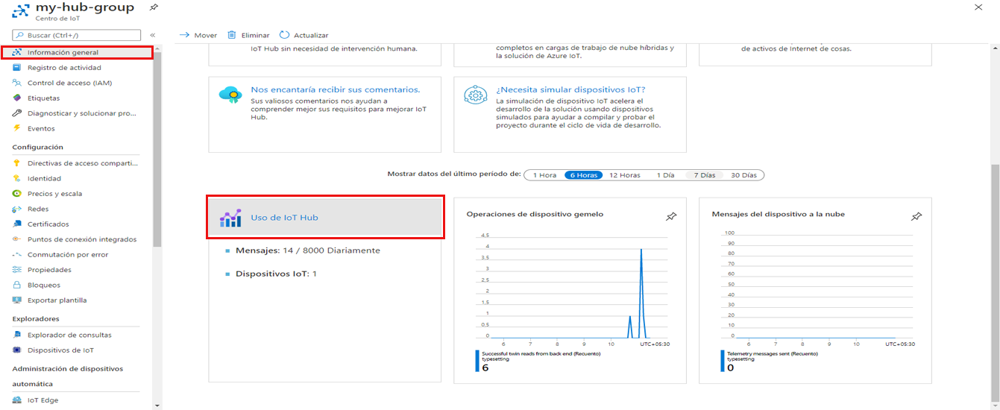

---
wts:
  title: "7: Implementar Azure\_IoT\_Hub (10\_minutos)"
  module: 'Module 03: Describe core solutions and management tools'
---
# 7: Implementar Azure IoT Hub (10 minutos)

In this walkthrough, we will configure a new Azure IoT Hub in Azure Portal, and then authenticate a connection to an IoT device using the online Raspberry Pi device simulator. Sensor data and messages are passed from the Raspberry Pi simulator to your Azure IoT Hub, and you view metrics for the messaging activity in Azure Portal.

# Tarea 1: Creación de un centro de IoT 

En esta tarea, crearemos una instancia de IoT Hub. 

1. Inicie sesión en [Azure Portal](https://portal.azure.com).

2. Desde la hoja **Todos los servicios**, busque y seleccione **Centro de IoT** y luego haga clic en **+ Agregar, + Crear, o + Nuevo**.

3. En la pestaña **Datos básicos** de la hoja **Centro de IoT**, complete los campos con los siguientes detalles (reemplace **xxxx** en el nombre de la cuenta de almacenamiento con letras y dígitos de modo que el nombre sea único a nivel global):

    | Configuración | Value |
    |--|--|
    | Subscription | **Mantener los valores predeterminados** |
    | Grupo de recursos | **Crear un grupo de recursos** |
    | Nombre de la instancia de IoT Hub | **my-hub-groupxxxxx** |
    | Region | **Este de EE. UU.** |

    **Nota**: Recuerde cambiar **xxxxx** de modo que sea un **nombre de IoT Hub** único.

4. Vaya a la pestaña **Administración** y use el menú desplegable para configurar **Nivel de precios y de escala** en **S1: Nivel estándar**.

5. Haga clic en el botón **Revisar y Crear**.

6. Haga clic en el botón **Crear** para comenzar a crear su nueva instancia de Azure IoT Hub.

7. Espere hasta que se implemente la instancia de Azure IoT Hub. 

# Tarea 2: Agregar un dispositivo de IoT

En esta tarea, agregaremos un dispositivo IoT al centro de IoT. 

1. When the deployment has completed, click <bpt id="p1">**</bpt>Go to resource<ept id="p1">**</ept> from the deployment blade. Alternatively, from the <bpt id="p1">**</bpt>All services<ept id="p1">**</ept> blade, search for and select <bpt id="p2">**</bpt>IoT Hub<ept id="p2">**</ept> and locate your new IoT Hub instance

    

2. To add a new IoT device, scroll down to the <bpt id="p1">**</bpt>Device management<ept id="p1">**</ept> section and click <bpt id="p2">**</bpt>Devices<ept id="p2">**</ept>. Then, click <bpt id="p1">**</bpt>+ Add Device<ept id="p1">**</ept>.

    

3. Los datos y los mensajes del sensor se pasan del simulador de Raspberry Pi a su Azure IoT Hub, y puede ver las métricas para la actividad de mensajería en Azure Portal.

4. Si no ve su nuevo dispositivo, **actualice** la página de dispositivos IoT. 

5. Select <bpt id="p1">**</bpt>myRaspberryPi<ept id="p1">**</ept> and copy the <bpt id="p2">**</bpt>Primary Connection String<ept id="p2">**</ept> value. You will use this key in the next task to authenticate a connection to the Raspberry Pi simulator.

    

# Tarea 3: Probar el dispositivo con el simulador de Raspberry Pi

En esta tarea probaremos nuestro dispositivo con el simulador de Raspberry Pi. 

1. Open a new tab in the web browser and type this shortcut link <ph id="ph1">https://aka.ms/RaspPi</ph>. It will take you to a Raspberry Pi Simulator site. If you have time, read about the Raspberry Pi simulator. When done select "<bpt id="p1">**</bpt>X<ept id="p1">**</ept>" to close the pop-up window.

2. In the code area on the right side, locate the line with 'const connectionString ='. Replace it with the connection string you copied from the Azure portal. Note that the connection sting includes the DeviceId (<bpt id="p1">**</bpt>myRaspberryPi<ept id="p1">**</ept>) and SharedAccessKey entries.

    

3. Click <bpt id="p1">**</bpt>Run<ept id="p1">**</ept> (below the code area) to run the application. The console output should show the sensor data and messages that are sent from the Raspberry Pi simulator to your Azure IoT Hub. Data and messages are sent each time the Raspberry Pi simulator LED flashes. 

    

5. Haga clic en **Detener** para dejar de enviar datos.

6. Vuelva a Azure Portal.

7. Switch the IoT Hub <bpt id="p1">**</bpt>Overview<ept id="p1">**</ept> blade and scroll down to the <bpt id="p2">**</bpt>IoT Hub Usage<ept id="p2">**</ept> information to view usage. Change your timeframe in the <bpt id="p1">**</bpt>show data for last<ept id="p1">**</ept> to see data in the last hour.

    

Congratulations! You have set up Azure IoT Hub to collect sensor data from an IoT device.

<bpt id="p1">**</bpt>Note<ept id="p1">**</ept>: To avoid additional costs, you can optionally remove this resource group. Search for resource groups, click your resource group, and then click <bpt id="p1">**</bpt>Delete resource group<ept id="p1">**</ept>. Verify the name of the resource group and then click <bpt id="p1">**</bpt>Delete<ept id="p1">**</ept>. Monitor the <bpt id="p1">**</bpt>Notifications<ept id="p1">**</ept> to see how the delete is proceeding.
