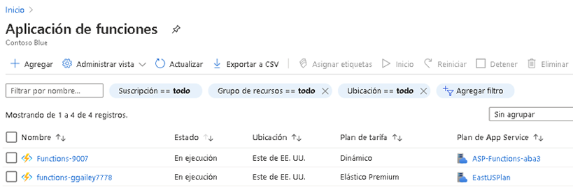
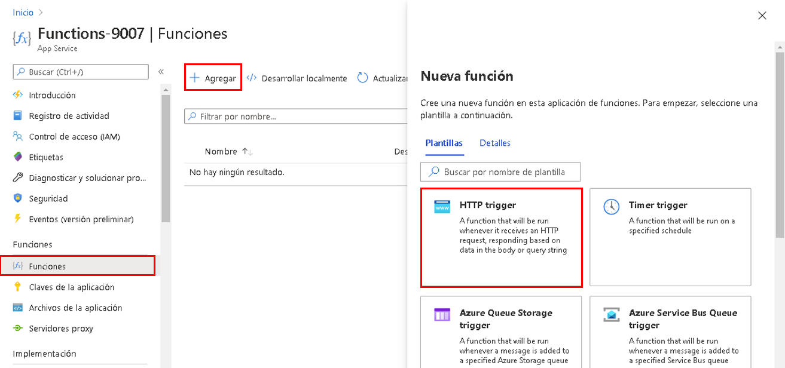
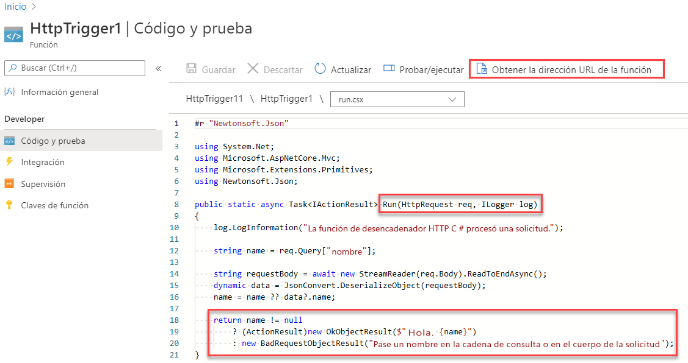
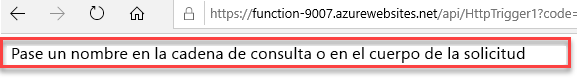
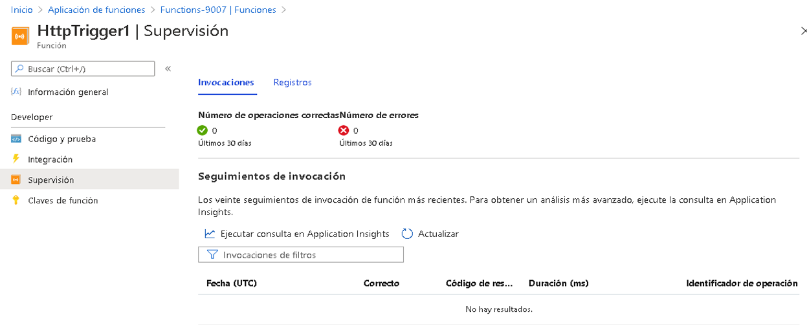

---
wts:
  title: "8: Implementar Azure\_Functions (5\_minutos)"
  module: 'Module 03: Describe core solutions and management tools'
---
# 8: Implementar Azure Functions (5 minutos)

En este tutorial, crearemos una aplicación de funciones para mostrar un mensaje de saludo cuando haya una solicitud HTTP. 

# Tarea 1: Crear una aplicación de funciones 

En esta tarea, crearemos un aplicación de funciones.

1. Inicie sesión en [Azure Portal](https://portal.azure.com).

2. En la barra de **Búsqueda** de la parte superior del portal, busque y seleccione **Aplicación de funciones** y luego, en la hoja **Aplicación de funciones**, haga clic en **+ Agregar, + Crear, o + Nuevo**.

3. En la pestaña **Datos básicos** de la hoja **Aplicación de funciones**, especifique la siguiente configuración (reemplace **xxxx** en el nombre de la función por letras y dígitos, de modo que el nombre sea único a nivel global, y deje todas las demás configuraciones con sus valores predeterminados): 

    | Configuración | Value |
    | -- | --|
    | Subscription | **Mantener los valores predeterminados** |
    | Grupo de recursos | **Crear un grupo de recursos** |
    | Nombre de la aplicación de funciones | **función-xxxx** |
    | Publicar | **Código** |
    | Pila en tiempo de ejecución | **.NET** |
    | Versión | **3.1** |
    | Region | **Este de EE. UU.** |

    **Nota**: Recuerde cambiar **xxxx** de modo que sea un **nombre de la aplicación de funciones** único.

4. Haga clic en **Revisar y crear** y, después de una correcta validación, haga clic en **Crear** para empezar a aprovisionar e implementar su nueva aplicación de funciones de Azure.

5. Espere la notificación de que el recurso ha sido creado.

6. When the deployment has completed, click Go to resource from the deployment blade. Alternatively, navigate back to the <bpt id="p1">**</bpt>Function App<ept id="p1">**</ept> blade, click <bpt id="p2">**</bpt>Refresh<ept id="p2">**</ept> and verify that the newly created function app has the <bpt id="p3">**</bpt>Running<ept id="p3">**</ept> status. 

    

# Tarea 2: Crear una función activada por HTTP y probar

En esta tarea, usaremos la función API de Webhook para mostrar un mensaje cuando haya una solicitud HTTP. 

1. Sobre la hoja **Aplicación de funciones**, haga clic en la aplicación de funciones recién creada. 

2. En la hoja Aplicación de funciones, en la sección **Funciones**, haga clic en **Funciones** y luego en **+ Agregar, + Crear, o +Nuevo**.

    

3. An <bpt id="p1">**</bpt>Add function<ept id="p1">**</ept> pop-up window will appear on the right. In the <bpt id="p1">**</bpt>Select a template<ept id="p1">**</ept> section click <bpt id="p2">**</bpt>HTTP trigger<ept id="p2">**</ept>. Click <bpt id="p1">**</bpt>Add<ept id="p1">**</ept> 

    

4. En la hoja **DesencadenadorHttp1**, en la sección **Desarrollador**, haga clic en **Código y prueba**. 

5. On the <bpt id="p1">**</bpt>Code + Test<ept id="p1">**</ept> blade, review the auto-generated code and note that the code is designed to run an HTTP request and log information. Also, notice the function returns a Hello message with a name. 

    

6. Haga clic en **Obtener URL de función** desde la sección superior del editor de funciones. 

7. Asegúrese de que el valor en la lista desplegable **Clave** se establece en **predeterminado** y haga clic en **Copiar** para copiar la función URL. 

    

8. Open a new browser tab and paste the copied function URL into your web browser's address bar. When the page is requested the function will run. Notice the returned message stating that the function requires a name in the request body.

    

9. Agregue **&name=*sunombre*** al final de la URL.

    **Nota**: Por ejemplo, si su nombre es Cindy, la URL final tendrá este aspecto: `https://azfuncxxx.azurewebsites.net/api/HttpTrigger1?code=X9xx9999xXXXXX9x9xxxXX==&name=cindy`

    

10. When you hit enter, your function runs and every invocation is traced. To view the traces, return to the Portal <bpt id="p1">**</bpt>HttpTrigger1 <ph id="ph1">\|</ph> Code + Test<ept id="p1">**</ept> blade and click <bpt id="p2">**</bpt>Monitor<ept id="p2">**</ept>. You can <bpt id="p1">**</bpt>configure<ept id="p1">**</ept> Application Insights by selecting the timestamp and click <bpt id="p2">**</bpt>Run query in Application Insights<ept id="p2">**</ept>.

     

Congratulations! You have created a Function App to display a Hello message when there is an HTTP request.  

<bpt id="p1">**</bpt>Note<ept id="p1">**</ept>: To avoid additional costs, you can optionally remove this resource group. Search for resource groups, click your resource group, and then click <bpt id="p1">**</bpt>Delete resource group<ept id="p1">**</ept>. Verify the name of the resource group and then click <bpt id="p1">**</bpt>Delete<ept id="p1">**</ept>. Monitor the <bpt id="p1">**</bpt>Notifications<ept id="p1">**</ept> to see how the delete is proceeding.
