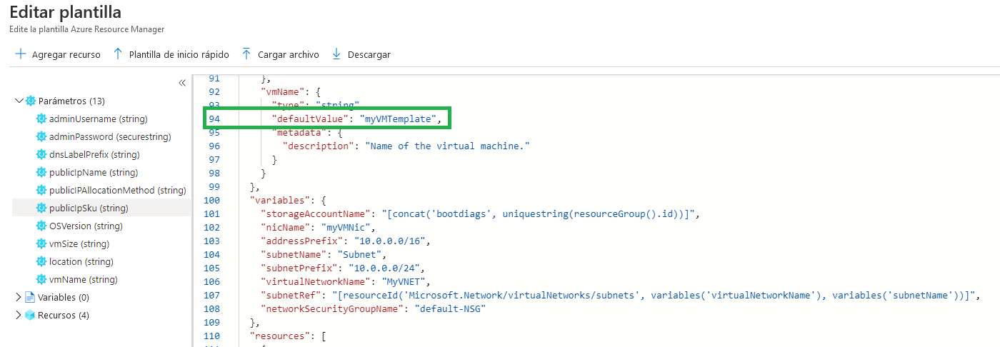
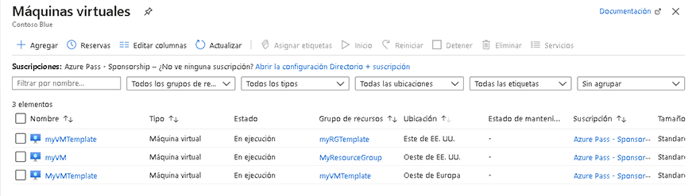
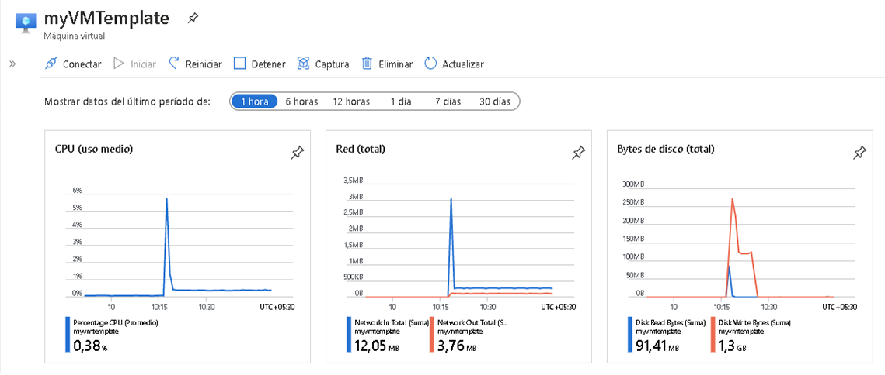
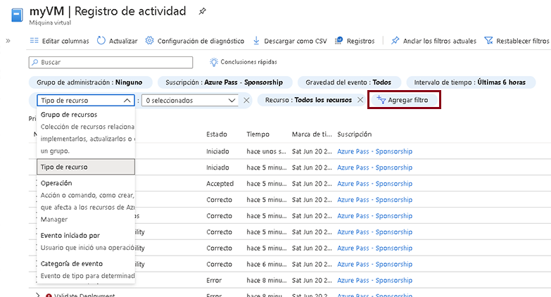

---
wts:
  title: "9: Crear una máquina virtual con una plantilla (10\_minutos)"
  module: 'Module 03: Describe core solutions and management tools'
---
# 9: Crear una máquina virtual con una plantilla (10 minutos)

En este tutorial implementaremos una máquina virtual con una plantilla de inicio rápido y examinaremos las funcionalidades de supervisión.

# Tarea 1: Explorar la galería de inicio rápido y localizar una plantilla 

En esta tarea, examinaremos la galería de inicio rápido de Azure e implementaremos una plantilla que crea una máquina virtual. 

1. Within the lab environment, open a new browser window, and enter T <ph id="ph1">https://azure.microsoft.com/en-us/resources/templates/?azure-portal=true</ph>. In the gallery you will find a number of popular and recently updated templates. These templates automate deployment of Azure resources, including installation of popular software packages. Browse through the many different types of templates that are available.

3. Seleccione **Implementar una VM de Windows sencilla**.

4. Click the <bpt id="p1">**</bpt>Deploy to Azure<ept id="p1">**</ept> button. Your browser session will be automatically redirected to the <bpt id="p1">[</bpt>Azure portal<ept id="p1">](http://portal.azure.com/)</ept>.

  <bpt id="p1">**</bpt>Note<ept id="p1">**</ept>: The <bpt id="p2">**</bpt>Deploy to Azure<ept id="p2">**</ept> button enables you to deploy the template via the Azure portal. During such deployment, you will be prompted only for small set of configuration parameters. 

5. Cuando se le solicite, inicie sesión en su suscripción de Azure con las credenciales proporcionadas anteriormente en las instrucciones.

6. Click <bpt id="p1">**</bpt>Edit template<ept id="p1">**</ept>. The Resource Manager template format uses the JSON format. Review the parameters and variables.  Then locate the parameter for virtual machine name. Change the name to <bpt id="p1">**</bpt>myVMTemplate<ept id="p1">**</ept>. <bpt id="p1">**</bpt>Save<ept id="p1">**</ept> your changes. 

    

7. Now configure the parameters required by the template (replace <bpt id="p1">***</bpt>xxxx<ept id="p1">***</ept> in the DNS label prefix with letters and digits such that the label is globally unique). Leave the defaults for everything else. 

    | Configuración| Valor|
    |----|----|
    | Subscription | **Mantener los valores predeterminados**|
    | Grupo de recursos | **Crear un grupo de recursos** |
    | Region | Mantenga el valor predeterminado |
    | Nombre de usuario administrador | **azureuser** |
    | Contraseña del administrador | **Pa$$w0rd1234** |
    | Prefijo de etiqueta DNS | **myvmtemplatexxxx** |
    | Versión del SO | **2019-Datacenter** |

9. Haga clic en **Revisar + crear**.

10. Supervise su implementación. 

# Tarea 2: Comprobar la máquina virtual y hacer un seguimiento de ella

En esta tarea, comprobaremos que la máquina virtual se implementó correctamente. 

1. Desde la hoja **Todos los servicios**, busque y seleccione **Maquinas virtuales**.

2. Asegúrese de que se haya creado su nueva máquina virtual. 

    

3. Seleccione su máquina virtual y, en el panel **Información general**, seleccione la pestaña **Supervisión** y desplácese hacia abajo para ver los datos de supervisión.

    **Nota**: El plazo de supervisión se puede ajustar de una hora a 30 días.

4. Revise los diferentes cuadros que se proporcionan, incluidos **CPU (promedio)** , **Red (total)** y **Bytes de disco (total)** . 

    

5. En el entorno de laboratorio, abra una nueva ventana del explorador e introduzca T https://azure.microsoft.com/en-us/resources/templates/?azure-portal=true.

6. En la galería encontrará una serie de plantillas populares y recientemente actualizadas.
7. Estas plantillas automatizan la implementación de los recursos de Azure, incluida la instalación de paquetes de software populares. 

8. Haga clic en **Agregar filtro** y experimente con la búsqueda de diferentes tipos de eventos y operaciones. 

    

Explore los diferentes tipos de plantillas disponibles.

<bpt id="p1">**</bpt>Note<ept id="p1">**</ept>: To avoid additional costs, you can optionally remove this resource group. Search for resource groups, click your resource group, and then click <bpt id="p1">**</bpt>Delete resource group<ept id="p1">**</ept>. Verify the name of the resource group and then click <bpt id="p1">**</bpt>Delete<ept id="p1">**</ept>. Monitor the <bpt id="p1">**</bpt>Notifications<ept id="p1">**</ept> to see how the delete is proceeding.
