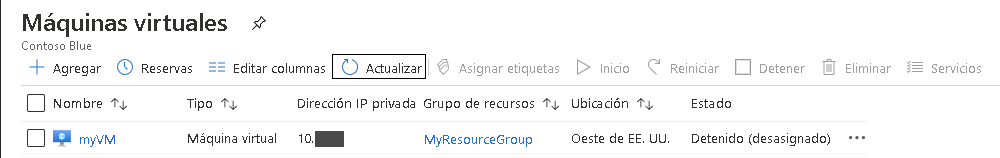
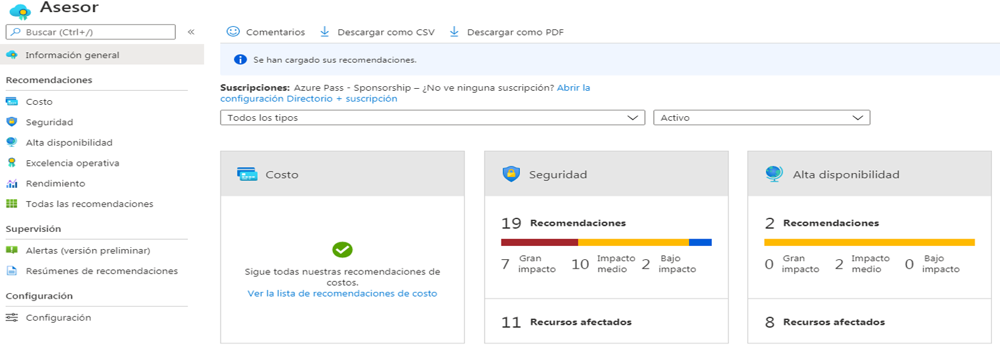
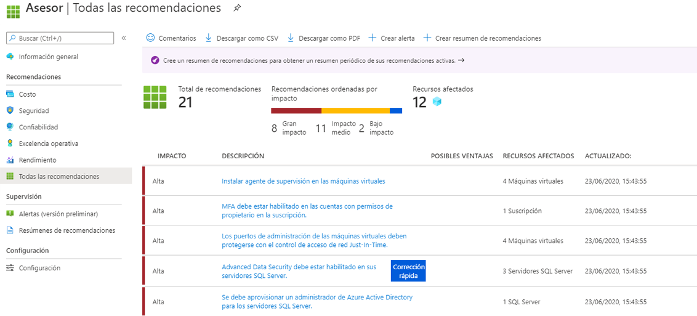

---
wts:
  title: "10: Crear una VM con PowerShell (10\_minutos)"
  module: 'Module 03: Describe core solutions and management tools'
---
# <a name="10---create-a-vm-with-powershell-10-min"></a>10: Crear una VM con PowerShell (10 minutos)

En este tutorial, configuraremos Cloud Shell, utilizaremos el módulo Azure PowerShell para crear un grupo de recursos y una máquina virtual, y revisaremos las recomendaciones de Azure Advisor. 

# <a name="task-1-configure-the-cloud-shell"></a>Tarea 1: Configuración de Cloud Shell 

En esta tarea, configuraremos Cloud Shell. 

1. Inicie sesión en [Azure Portal](https://portal.azure.com).** Puede encontrar sus credenciales de inicio de sesión en la pestaña Recursos (justo al lado de la pestaña Instrucciones). **
2. Desde Azure Portal, abra **Azure Cloud Shell** desde Azure Portal. Para ello, haga clic en el icono de la esquina superior derecha de Azure Portal.

    

3. Cuando se le pida que seleccione **Bash** o **PowerShell**, seleccione **PowerShell**.

4. En la pantalla **No tiene ningún almacenamiento montado**, seleccione **Mostrar la configuración avanzada** y luego complete la siguiente información.

    | Configuración | Valores |
    |  -- | -- |
    | Grupo de recursos | **Crear un grupo de recursos** |
    | Cuenta de almacenamiento (cree una cuenta nueva y use un nombre único a nivel global [p. ej., almacenamientocloudshellmialmacenamiento]). | **cloudshellxxxxxxx** |
    | Recurso compartido de archivos (Crear nuevo) | **shellstorage** |

5. Seleccione **Crear almacenamiento**.

# <a name="task-2-create-a-resource-group-and-virtual-machine"></a>Tarea 2: Crear un grupo de recursos y una máquina virtual.

En esta tarea, utilizaremos PowerShell para crear un grupo de recursos y una máquina virtual.  

1. Asegúrese de que **PowerShell** esté seleccionado en el menú desplegable superior izquierdo del panel de Cloud Shell.

2. Verify your new resource group by running the following command in the Powershell window. Press <bpt id="p1">**</bpt>Enter<ept id="p1">**</ept> to run the command.

    ```PowerShell
    Get-AzResourceGroup | Format-Table
    ```

3. Cree una máquina virtual. Para ello, pegue el siguiente comando en la ventana del terminal. 

    ```PowerShell
    New-AzVm `
    -ResourceGroupName "myRGPS" `
    -Name "myVMPS" `
    -Location "East US" `
    -VirtualNetworkName "myVnetPS" `
    -SubnetName "mySubnetPS" `
    -SecurityGroupName "myNSGPS" `
    -PublicIpAddressName "myPublicIpPS"
    ```
    
4. Cuando se le pida, dé el nombre de usuario (**azureuser**) y la contraseña (**Pa$$w0rd1234**) que se configurará como la cuenta de administrador local en esas máquinas virtuales.azureadmin

5. Una vez que se haya creado la VM, cierre el panel de Cloud Shell en la sesión de PowerShell.

6. In the Azure portal, search for <bpt id="p1">**</bpt>Virtual machines<ept id="p1">**</ept> and verify the <bpt id="p2">**</bpt>myVMPS<ept id="p2">**</ept> is running. This may take a few minutes.

    

7. Acceda a la nueva máquina virtual y revise las configuraciones de Descripción general y Redes para comprobar que su información se haya implementado correctamente. 

# <a name="task-3-execute-commands-in-the-cloud-shell"></a>Tarea 3: Ejecutar comandos en Cloud Shell

En esta tarea, practicaremos la ejecución de comandos de PowerShell desde Cloud Shell. 

1. Desde Azure Portal, abra **Azure Cloud Shell** desde Azure Portal. Para ello, haga clic en el icono de la esquina superior derecha de Azure Portal.

2. Asegúrese de que **PowerShell** esté seleccionado en el menú desplegable superior izquierdo del panel de Cloud Shell.

3. Retrieve information about your virtual machine including name, resource group, location, and status. Notice the PowerState is <bpt id="p1">**</bpt>running<ept id="p1">**</ept>.

    ```PowerShell
    Get-AzVM -name myVMPS -status | Format-Table -autosize
    ```

4. Detenga la máquina virtual con el comando siguiente. 

    ```PowerShell
    Stop-AzVM -ResourceGroupName myRGPS -Name myVMPS
    ```
5. When prompted confirm (Yes) to the action. Wait for <bpt id="p1">**</bpt>Succeeded<ept id="p1">**</ept> status.

6. Verify your virtual machine state. The PowerState should now be <bpt id="p1">**</bpt>deallocated<ept id="p1">**</ept>. You can also verify the virtual machine status in the portal. Close Cloudshell.

    ```PowerShell
    Get-AzVM -name myVMPS -status | Format-Table -autosize
    ```

# <a name="task-4-review-azure-advisor-recommendations"></a>Tarea 4: Revisar las recomendaciones de Azure Advisor

**Nota:** Esta misma tarea se encuentra en el laboratorio Crear una VM con la CLI de Azure. 

En esta tarea, revisaremos las recomendaciones de Azure Advisor para nuestra máquina virtual. 

1. Desde la hoja **Todos los servicios**, busque y seleccione **Advisor**. 

2. On the <bpt id="p1">**</bpt>Advisor<ept id="p1">**</ept> blade, select <bpt id="p2">**</bpt>Overview<ept id="p2">**</ept>. Notice recommendations are grouped by Reliability, Security, Performance, and Cost. 

    

3. Seleccione **Todas las recomendaciones** y tómese un tiempo para ver cada recomendación y acciones sugeridas. 

    **Nota:** Dependiendo de sus recursos, sus recomendaciones serán diferentes. 

    

4. Tenga en cuenta que puede descargar las recomendaciones como un archivo CSV o PDF. 

5. Tenga en cuenta que puede crear alertas. 

6. Si tiene tiempo, continúe experimentando con Azure PowerShell. 

Congratulations! You have configured Cloud Shell, created a virtual machine using PowerShell, practiced with PowerShell commands, and viewed Advisor recommendations.

<bpt id="p1">**</bpt>Note<ept id="p1">**</ept>: To avoid additional costs, you can optionally remove this resource group. Search for resource groups, click your resource group, and then click <bpt id="p1">**</bpt>Delete resource group<ept id="p1">**</ept>. Verify the name of the resource group and then click <bpt id="p1">**</bpt>Delete<ept id="p1">**</ept>. Monitor the <bpt id="p1">**</bpt>Notifications<ept id="p1">**</ept> to see how the delete is proceeding.
