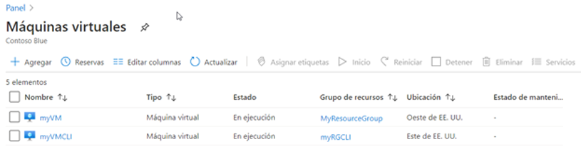
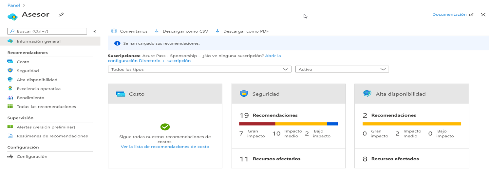
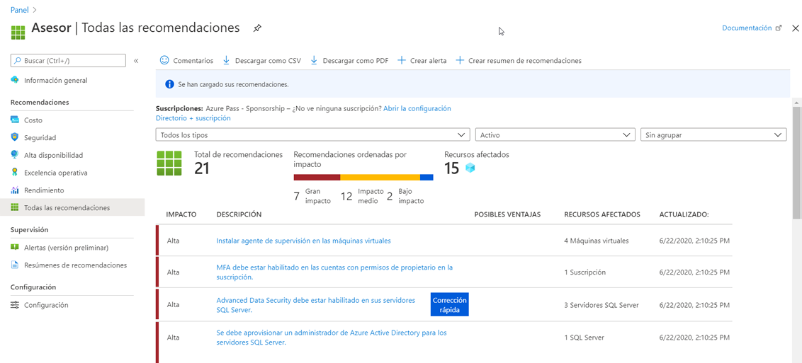

---
wts:
  title: "11: Crear una VM con la CLI (10\_minutos)"
  module: 'Module 03: Describe core solutions and management tools'
---
# <a name="11---create-a-vm-with-the-cli-10-min"></a>11: Crear una VM con la CLI (10 minutos)

En este tutorial, configuraremos Cloud Shell, utilizaremos la CLI de Azure para crear un grupo de recursos y una máquina virtual, y revisaremos las recomendaciones de Azure Advisor. 

# <a name="task-1-configure-the-cloud-shell"></a>Tarea 1: Configuración de Cloud Shell 

En esta tarea, configuraremos Cloud Shell y usaremos la CLI de Azure para crear un grupo de recursos y una máquina virtual.  

1. Inicie sesión en [Azure Portal](https://portal.azure.com).

2. Desde Azure Portal, abra **Azure Cloud Shell** desde Azure Portal. Para ello, haga clic en el icono de la esquina superior derecha de Azure Portal.

    
   
3. En el cuadro de diálogo Azure Cloud Shell, cuando se le pida que seleccione **Bash** o **PowerShell**, seleccione **Bash**. 

4. A new window will open stating <bpt id="p1">**</bpt>You have no storage mounted<ept id="p1">**</ept>. Select <bpt id="p1">**</bpt>advanced settings<ept id="p1">**</ept>.

5. En la pantalla Configuración avanzada, rellene los siguientes campos y después haga clic en Crear almacenamiento:
    - Grupo de recursos: **Crear nuevo grupo de recursos**
    - Cuenta de almacenamiento: Cree una cuenta nueva y use un nombre único a nivel global (p. ej., cloudshellalmacenamientoxyz).
    - Recurso compartido de archivos: Cree un nuevo archivo y asígnele el nombre recursocompartidodearchivoscloudshell.


# <a name="task-2-use-cli-to-create-a-virtual-machine"></a>Tarea 2: Usar la CLI para crear una máquina virtual

En esta tarea, usaremos la CLI de Azure para crear un grupo de recursos y una máquina virtual.

1. Asegúrese de que **Bash** esté seleccionado en el menú desplegable superior izquierdo del panel Cloud Shell (y si no, selecciónelo).

    


2. Compruebe el grupo de recursos que utiliza mediante el siguiente comando:

    ```cli
    az group list --output table
    ```

4. In Cloud Shell enter the command below and make sure that each line, except for the last one, is followed by the backslash (<ph id="ph1">`\`</ph>) character. If you type the whole command on the same line, do not use any backslash characters. 

    ```cli
    az vm create \
    --name myVMCLI \
    --resource-group myRGCLI \
    --image UbuntuLTS \
    --location EastUS2 \
    --admin-username azureuser \
    --admin-password Pa$$w0rd1234
    ```

    >**Nota**: Si utiliza la línea de comandos en un equipo Windows, reemplace el carácter de barra diagonal inversa (`\`) con el carácter de intercalación (`^`).

    <bpt id="p1">**</bpt>Note<ept id="p1">**</ept>: The command will take 2 to 3 minutes to complete. The command will create a virtual machine and various resources associated with it such as storage, networking and security resources. Do not continue to the next step until the virtual machine deployment is complete. 

5. Cuando el comando termine de ejecutarse, en la ventana del explorador cierre el panel Cloud Shell.

6. En Azure Portal, busque **Virtual Machines** y verifique que **myVMCLI** se está ejecutando.

    


# <a name="task-3-execute-commands-in-the-cloud-shell"></a>Tarea 3: Ejecutar comandos en Cloud Shell

En esta tarea, practicaremos la ejecución de comandos de CLI desde Cloud Shell. 

1. Desde Azure Portal, abra **Azure Cloud Shell** desde Azure Portal. Para ello, haga clic en el icono de la esquina superior derecha de Azure Portal.

2. Asegúrese de que **Bash** esté seleccionado en el menú desplegable superior izquierdo del panel Cloud Shell.

3. Retrieve information about the virtual machine you provisioned, including name, resource group, location, and status. Notice the PowerState is <bpt id="p1">**</bpt>running<ept id="p1">**</ept>.

    ```cli
    az vm show --resource-group myRGCLI --name myVMCLI --show-details --output table 
    ```

4. Stop the virtual machine. Notice the message that billing continues until the virtual machine is deallocated. 

    ```cli
    az vm stop --resource-group myRGCLI --name myVMCLI
    ```

5. Verify your virtual machine status. The PowerState should now be <bpt id="p1">**</bpt>stopped<ept id="p1">**</ept>.

    ```cli
    az vm show --resource-group myRGCLI --name myVMCLI --show-details --output table 
    ```

# <a name="task-4-review-azure-advisor-recommendations"></a>Tarea 4: Revisar las recomendaciones de Azure Advisor

En esta tarea, revisaremos las recomendaciones de Azure Advisor.

   **Nota:** Si ha completado el laboratorio anterior (Crear una VM con PowerShell), entonces ya ha realizado esta tarea. 

1. Desde la hoja **Todos los servicios**, busque y seleccione **Advisor**. 

2. On the <bpt id="p1">**</bpt>Advisor<ept id="p1">**</ept> blade, select <bpt id="p2">**</bpt>Overview<ept id="p2">**</ept>. Notice recommendations are grouped by Reliability, Security, Performance, and Cost. 

    

3. Seleccione **Todas las recomendaciones** y tómese un tiempo para ver cada recomendación y acciones sugeridas. 

    **Nota:** Dependiendo de sus recursos, sus recomendaciones serán diferentes. 

    

4. Tenga en cuenta que puede descargar las recomendaciones como un archivo CSV o PDF. 

5. Tenga en cuenta que puede crear alertas. 

6. Si tiene tiempo, continúe experimentando con la CLI de Azure. 

Congratulations! You have configured Cloud Shell, created a virtual machine using Azure CLI, practiced with Azure CLI commands, and viewed Advisor recommendations.

<bpt id="p1">**</bpt>Note<ept id="p1">**</ept>: To avoid additional costs, you can optionally remove this resource group. Search for resource groups, click your resource group, and then click <bpt id="p1">**</bpt>Delete resource group<ept id="p1">**</ept>. Verify the name of the resource group and then click <bpt id="p1">**</bpt>Delete<ept id="p1">**</ept>. Monitor the <bpt id="p1">**</bpt>Notifications<ept id="p1">**</ept> to see how the delete is proceeding.
