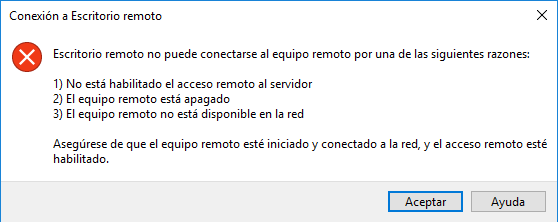

---
wts:
  title: "13: Proteger el tráfico de red (10\_minutos)"
  module: 'Module 04: Describe general security and network security features'
---
# 13: Proteger el tráfico de red (10 minutos)

En este tutorial, configuraremos un grupo de seguridad de red.

# Tarea 1: Creación de una máquina virtual

En esta tarea, crearemos una máquina virtual de Windows Server 2019 Datacenter. 

1. Inicie sesión en [Azure Portal](https://portal.azure.com).

2. Desde la hoja **Todos los servicios**, busque y seleccione **Máquinas virtuales** y haga clic en **+ Agregar, + Crear, o + Nueva** máquina virtual.

3. En la pestaña **Datos básicos**, complete la siguiente información (deje los valores predeterminados para todo lo demás):

    | Configuración | Valores |
    |  -- | -- |
    | Subscription | **Uso de los valores predeterminados** |
    | Resource group | **Crear un grupo de recursos** |
    | Nombre de la máquina virtual | **SimpleWinVM** |
    | Region | **(EE. UU.) Este de EE. UU.**|
    | Imagen | **Windows Server 2019 Datacenter Gen 2**|
    | Size | **Estándar D2s v3**|
    | Nombre de usuario de la cuenta de administrador | **azureuser** |
    | Contraseña de cuenta de administrador | **Pa$$w0rd1234**|
    | Reglas de puerto de entrada | **None**|

4. Cambie a la pestaña **Redes** y configure la siguiente configuración:

    | Configuración | Valores |
    | -- | -- |
    | Grupo de seguridad de red de NIC | **None**|

5. Vaya a la pestaña **Administración** y, en la sección **Supervisión**, seleccione la siguiente configuración:

    | Configuración | Valores |
    | -- | -- |
    | Diagnósticos de arranque | **Deshabilitar**|

6. Deje los valores predeterminados restantes y luego haga clic en el botón **Revisar y crear** en la parte inferior de la página.

7. Once Validation is passed click the <bpt id="p1">**</bpt>Create<ept id="p1">**</ept> button. It can take about five minutes to deploy the virtual machine.

8. Monitor the deployment. It may take a few minutes for the resource group and virtual machine to be created. 

9. Desde la hoja de implementación o desde el área Notificación, haga clic en **Ir al recurso**. 

10. Sobre la hoja de la máquina virtual **SimpleWinVM**, haga clic en **Redes**, revise la pestaña de **Reglas de puerto de entrada** y tenga en cuenta que no hay un grupo de seguridad de red asociado con la interfaz de red de la máquina virtual o la subred a la que está conectada la interfaz de red.

    <bpt id="p1">**</bpt>Note<ept id="p1">**</ept>: Identify the name of the network interface. You will need it in the next task.

# Tarea 2: Creación de un grupo de seguridad de red

En esta tarea, crearemos un grupo de seguridad de red y lo asociaremos con la interfaz de red. 

1. Desde la hoja **Todos los servicios**, busque y seleccione **Grupos de seguridad de red** y luego haga clic en **+ Agregar, + Crear, o +Nuevo**.

2. En la pestaña **Datos básicos** de la hoja **Crear grupo de seguridad de red**, especifique la siguiente configuración.

    | Configuración | Valor |
    | -- | -- |
    | Subscription | **Utilizar la suscripción predeterminada** |
    | Grupo de recursos | **Seleccionar el predeterminado en el menú desplegable** |
    | Nombre | **myNSGSecure** |
    | Region | **(EE. UU.) Este de EE. UU.**  |

3. Haga clic en **Revisar y crear** y luego, después de la validación, haga clic en **Crear**.

4. Después de crear el NSG, haga clic en **Ir al recurso**.

5. Debajo de **Configuración**, haga clic en **Interfaces de red** y luego en **Asociar**.

6. Seleccione la interfaz de red que identificó en la tarea anterior. 

# Tarea 3: Configurar una regla de puerto de seguridad entrante para permitir RDP

En esta tarea, permitiremos el tráfico RDP a la máquina virtual mediante la configuración de una regla de puerto de seguridad entrante. 

1. En Azure Portal, navegue hasta la hoja de la máquina virtual **VMWinsencilla**. 

2. Sobre el panel de **Visión general**, haga clic en **Conectar**.

3. Attempt to connect to the virtual machine by selecting RDP and downloading an running the RDP file. By default the network security group does not allow RDP. Close the error window. 

    

4. En la hoja de la máquina virtual, desplácese hacia abajo hasta la sección **Configuración**, haga clic en **Redes** y observe que las reglas de entrada del el grupo de seguridad de red **miNSGSeguro (conectado a la interfaz de red: miVMNic)** deniegan todo el tráfico entrante, excepto el tráfico dentro de la red virtual y los sondeos del equilibrador de carga.

5. On the <bpt id="p1">**</bpt>Inbound port rules<ept id="p1">**</ept> tab, click <bpt id="p2">**</bpt>Add inbound port rule<ept id="p2">**</ept> . Click <bpt id="p1">**</bpt>Add<ept id="p1">**</ept> when you are done. 

    | Configuración | Value |
    | -- | -- |
    | Source | **Cualquiera**|
    | Source port ranges | **\*** |
    | Destination | **Cualquiera** |
    | Intervalos de puertos de destino | **3389** |
    | Protocolo | **TCP** |
    | Acción | **Permitir** |
    | Priority | **300** |
    | Name | **AllowRDP** |

6. Select <bpt id="p1">**</bpt>Add<ept id="p1">**</ept> and wait for the rule to be provisioned and then try again to RDP into the virtual machine by going back to <bpt id="p2">**</bpt>Connect<ept id="p2">**</ept> This time you should be successful. Remember the user is <bpt id="p1">**</bpt>azureuser<ept id="p1">**</ept> and the password is <bpt id="p2">**</bpt>Pa$$w0rd1234<ept id="p2">**</ept>.

# Tarea 4: Configurar una regla de puerto de seguridad saliente para denegar el acceso a Internet

En esta tarea, crearemos una regla de puerto saliente NSG que denegará el acceso a Internet y luego la probaremos para asegurarnos de que la regla funciona.

1. Continúe en su sesión de máquina virtual RDP. 

2. Después de que la máquina arranque, abra el explorador de **Internet Explorer**. 

3. Verify that you can access <bpt id="p1">**</bpt><ph id="ph1">https://www.bing.com</ph><ept id="p1">**</ept> and then close Internet Explorer. You will need to work through the IE enhanced security pop-ups. 

    **Nota**: Ahora configuraremos una regla para denegar el acceso saliente a Internet. 

4. En Azure Portal, vuelva a la hoja de la máquina virtual **SimpleWinVM**. 

5. En **Configuración**, haga clic en **Redes** y después en **Reglas de puerto de salida**.

6. Notice there is a rule, <bpt id="p1">**</bpt>AllowInternetOutbound<ept id="p1">**</ept>. This a default rule and cannot be removed. 

7. Click <bpt id="p1">**</bpt>Add outbound port rule<ept id="p1">**</ept> to the right of the <bpt id="p2">**</bpt>myNSGSecure  (attached to network interface: myVMNic)<ept id="p2">**</ept> network security group and configure a new outbound security rule with a higher priority that will deny internet traffic. Click <bpt id="p1">**</bpt>Add<ept id="p1">**</ept> when you are finished. 

    | Configuración | Valor |
    | -- | -- |
    | Source | **Cualquiera**|
    | Source port ranges | **\*** |
    | Destination | **Etiqueta de servicio** |
    | Etiqueta de servicio de destino | **Internet** |
    | Intervalos de puertos de destino | **\*** |
    | Protocolo | **TCP** |
    | Acción | **Deny** |
    | Priority | **4000** |
    | Nombre | **DenyInternet** |

8. Haga clic en **Agregar**. Configure de nuevo el RDP en la VM. 

9. Browse to <bpt id="p1">**</bpt><ph id="ph1">https://www.microsoft.com</ph><ept id="p1">**</ept>. The page should not display. You may need to work through additional IE enhanced security pop-ups.  

<bpt id="p1">**</bpt>Note<ept id="p1">**</ept>: To avoid additional costs, you can optionally remove this resource group. Search for resource groups, click your resource group, and then click <bpt id="p1">**</bpt>Delete resource group<ept id="p1">**</ept>. Verify the name of the resource group and then click <bpt id="p1">**</bpt>Delete<ept id="p1">**</ept>. Monitor the <bpt id="p1">**</bpt>Notifications<ept id="p1">**</ept> to see how the delete is proceeding.
