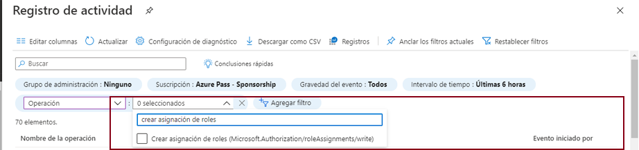

---
wts:
  title: "14: Administrar el acceso con RBAC (5\_minutos)"
  module: 'Module 05: Describe identity, governance, privacy, and compliance features'
---
# 14: Administrar el acceso con RBAC (5 minutos)

En este tutorial, asignaremos roles de permiso a recursos y veremos registros.

# Tarea 1: Ver y asignar roles

En esta tarea, asignaremos el rol de colaborador de la máquina virtual. 

1. Inicie sesión en [Azure Portal](https://portal.azure.com).

2. Desde la hoja **Todos los servicios**, busque y seleccione **Grupos de recursos** y luego haga clic en **+ Agregar, + Crear, o + Nuevo**.

3. Create a new resource group. Click <bpt id="p1">**</bpt>Create<ept id="p1">**</ept> when you are finished. 

    | Configuración | Valor |
    | -- | -- |
    | Subscription | **Uso de los valores predeterminados** |
    | Grupo de recursos | **myRGRBAC** |
    | Region | **(EE. UU.) Este de EE. UU.** |
   

4. Para crear, use **Revisar y crear** y luego haga clic en **Crear**.

5. Use **Actualizar** en la página del grupo de recursos y haga clic en la entrada que representa el grupo de recursos recién creado.

6. Click on the <bpt id="p1">**</bpt>Access control (IAM)<ept id="p1">**</ept> blade, and then switch to the <bpt id="p2">**</bpt>Roles<ept id="p2">**</ept> tab. Scroll through the large number of roles definitions that are available. Use the Informational icons to get an idea of each role's permissions. Notice there is also information on the number of users and groups that are assigned to each role.
7. 

7. Switch to the <bpt id="p1">**</bpt>Role assignments<ept id="p1">**</ept> tab of the <bpt id="p2">**</bpt>myRGRBAC - Access control (IAM)<ept id="p2">**</ept> blade, click <bpt id="p3">**</bpt>+ Add<ept id="p3">**</ept> and then click <bpt id="p4">**</bpt>Add role assignment<ept id="p4">**</ept>. Search for the Virtual Machine Contributor role and select. Switch to the "Members" tab and Assign access to: User, group, or service principal. Then click + Select members and type in your name to the popup search function and hit 'select.' Then hit 'Review and Assign'

    
    

 

    **Nota:** El rol de colaborador de la máquina virtual le permite administrar máquinas virtuales, pero no acceder a su sistema operativo ni administrar la red virtual ni la cuenta de almacenamiento a la que estén conectadas.

  

8. Haga clic en **Actualizar** en la página de asignaciones de roles y asegúrese de que ahora esté incluido como colaborador de la máquina virtual. 

    **Nota**: Esta asignación en realidad no le concede ningún privilegio adicional, ya que su cuenta ya tiene el rol Propietario, que incluye todos los privilegios asociados al rol Colaborador.

# Tarea 2: Supervisar asignaciones de roles y quitar un rol

En esta tarea, veremos el registro de actividad para comprobar la asignación de roles y luego quitaremos el rol. 

1. En la hoja del grupo de recursos myRGRBAC, haga clic en **Registro de actividad**.

2. Haga clic en **Agregar filtro**, seleccione **Operación** y luego haga clic en **Crear asignación de roles**.

    

3. Compruebe que el registro de actividad muestre su asignación de roles. 

    **Nota**: ¿Sabe cómo quitar su asignación de roles?

Congratulations! You created a resource group, assigned an access role to it and viewed activity logs. 

<bpt id="p1">**</bpt>Note<ept id="p1">**</ept>: To avoid additional costs, you can optionally remove this resource group. Search for resource groups, click your resource group, and then click <bpt id="p1">**</bpt>Delete resource group<ept id="p1">**</ept>. Verify the name of the resource group and then click <bpt id="p1">**</bpt>Delete<ept id="p1">**</ept>. Monitor the <bpt id="p1">**</bpt>Notifications<ept id="p1">**</ept> to see how the delete is proceeding.

