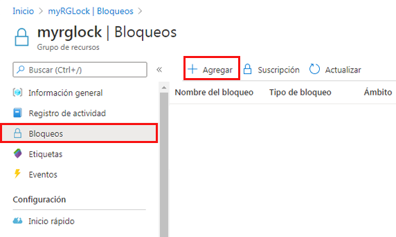
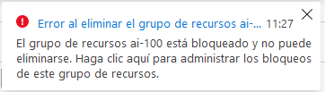
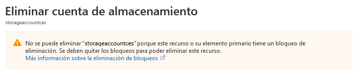
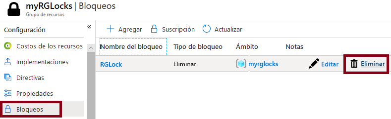

---
wts:
  title: "15: Administrar bloqueos de recursos (5\_minutos)"
  module: 'Module 05: Describe identity, governance, privacy, and compliance features'
---
# 15: Administrar bloqueos de recursos (5 minutos)

In this walkthrough, we will add a lock to the resource group and test deleting the resource group. Locks can be applied in a subscription to resource groups, or individual resources to prevent accidental deletion or modification of critical resources.  

# Tarea 1:  Agregar un bloqueo al grupo de recursos y probar su eliminación

En esta tarea, agregaremos un bloqueo de recursos al grupo de recursos y probaremos la eliminación del grupo de recursos. 

1. Inicie sesión en [Azure Portal](https://portal.azure.com).

2. En Azure Portal, vaya al grupo de recursos **myRGLocks**.

3. Puede aplicar un bloqueo a una suscripción, un grupo de recursos o un recurso individual para evitar la eliminación o modificación accidental de recursos críticos. 

4. En la sección **Configuración**, haga clic en **Bloqueos** y, a continuación, haga clic en **+ Agregar**. 

    

5. Configure the new lock. When you are done click <bpt id="p1">**</bpt>OK<ept id="p1">**</ept>. 

    | Configuración | Valor |
    | -- | -- |
    | Nombre del bloqueo | "RGLock" |
    | Tipo de bloqueo | **Eliminar** |
    | | |

6. Click <bpt id="p1">**</bpt>Overview<ept id="p1">**</ept> and click <bpt id="p2">**</bpt>Delete resource group<ept id="p2">**</ept>. Type the name of the resource group and click <bpt id="p1">**</bpt>OK<ept id="p1">**</ept>. You receive an error message stating the resource group is locked and can't be deleted.

    

# Tarea 2: Probar a eliminar un miembro del grupo de recursos

En esta tarea, probaremos si el bloqueo de recursos protege una cuenta de almacenamiento en el grupo de recursos. 

1. Desde la hoja **Todos los servicios**, busque y seleccione **Cuentas de almacenamiento** y haga clic en **+ Agregar, + Crear, o + Nuevo** 

2. En este tutorial, agregaremos un bloqueo al grupo de recursos y probaremos la eliminación del grupo de recursos.

    | Configuración | Valor | 
    | --- | --- |
    | Suscripción | **Seleccione la suscripción** |
    | Grupo de recursos | **myRGLocks** |
    | Nombre de la cuenta de almacenamiento | **storageaccountxxxx** |
    | Location | **(EE. UU.) Este de EE. UU.**  |
    | Rendimiento | **Estándar** |
    | Tipo de cuenta | **StorageV2 (uso general v2)** |
    | Replicación | **Almacenamiento con redundancia local (LRS)** |
    | Nivel de acceso (predeterminado) | **Acceso frecuente** |
   

3. Haga clic en **Revisar y crear** para revisar la configuración de su cuenta de almacenamiento y permitir que Azure valide la configuración. 

4. Se pueden aplicar bloqueos a una suscripción de un grupo de recursos o a recursos individuales para evitar la eliminación o modificación accidental de recursos críticos. 

5.  Espere la notificación de que la cuenta de almacenamiento se creó correctamente. 

6. Access your new storage account and from the <bpt id="p1">**</bpt>Overview<ept id="p1">**</ept> pane, click <bpt id="p2">**</bpt>Delete<ept id="p2">**</ept>. You receive an error message stating the resource or its parent has a delete lock. 

    

    <bpt id="p1">**</bpt>Note<ept id="p1">**</ept>: Although we did not create a lock specifically for the storage account, we did create a lock at the resource group level, which contains the storage account. As such, this <bpt id="p1">*</bpt>parent<ept id="p1">*</ept> level lock prevents us from deleting the resource and the storage account inherits the lock from the parent.

# Tarea 3: Quitar el bloqueo de recurso

En esta tarea quitaremos el bloqueo del recurso y lo probaremos. 

1. Vuelva a la hoja del grupo de recursos **myRGLocks-XXXXXXXX** y, en la sección **Configuración**, haga clic en **Bloqueos**.
    
2. Haga clic en el vínculo **Eliminar** de la derecha de la entrada **myRGLocks-XXXXXXXX**, a la derecha de **Editar**.

    

3. Vuelva a la hoja de la cuenta de almacenamiento y confirme que ahora puede eliminar el recurso.

Congratulations! You created a resource group, added a lock to resource group and tested deletion, tested deleting a resource in the resource group, and removed the resource lock. 

<bpt id="p1">**</bpt>Note<ept id="p1">**</ept>: To avoid additional costs, you can optionally remove this resource group. Search for resource groups, click your resource group, and then click <bpt id="p1">**</bpt>Delete resource group<ept id="p1">**</ept>. Verify the name of the resource group and then click <bpt id="p1">**</bpt>Delete<ept id="p1">**</ept>. Monitor the <bpt id="p1">**</bpt>Notifications<ept id="p1">**</ept> to see how the delete is proceeding.
