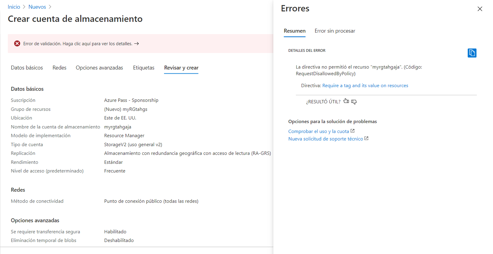
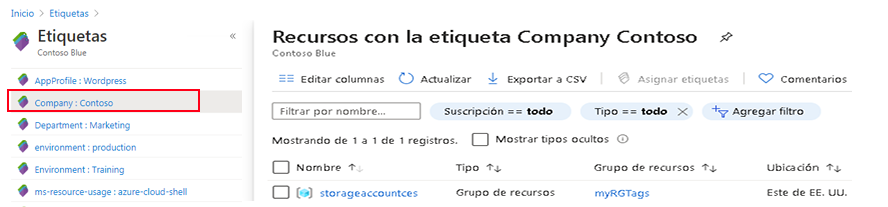
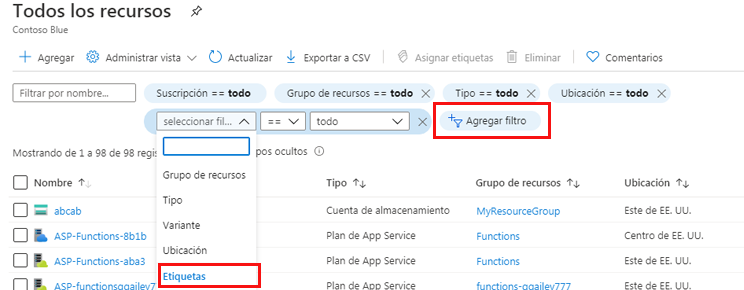

---
wts:
  title: "16: Implementar el etiquetado de recursos (5\_minutos)"
  module: 'Module 05: Describe identity, governance, privacy, and compliance features'
---
# 16: Implementar el etiquetado de recursos (5 minutos)

En este tutorial, crearemos una asignación de directiva que requiera etiquetado, crearemos una cuenta de almacenamiento y probaremos el etiquetado, veremos recursos con una etiqueta específica y quitaremos la directiva de etiquetado.

# Tarea 1: Crear una asignación de directiva 

En esta tarea, configuraremos la directiva **Requerir una etiqueta en los recursos** y la asignaremos a nuestra suscripción. 

1. Inicie sesión en [Azure Portal](https://portal.azure.com).

2. Desde la hoja **Todos los servicios**, busque y seleccione **Directiva**.

3. Desplácese hacia abajo hasta la sección **Creación**, haga clic en **Asignaciones** y luego haga clic en **Asignar directiva** desde la parte superior de la página.

4. Tenga en cuenta que el **Ámbito** para nuestra directiva será toda la suscripción. 

5. Under <bpt id="p1">**</bpt>Basics<ept id="p1">**</ept> Select the <bpt id="p2">**</bpt>Policy definition<ept id="p2">**</ept> ellipsis button (right side of textbox). In the <bpt id="p1">**</bpt>Search<ept id="p1">**</ept> box, enter the value <bpt id="p2">**</bpt>tag<ept id="p2">**</ept>. A list of related Policies with the word <bpt id="p1">**</bpt>tag<ept id="p1">**</ept> will appear. Scroll down till you find the <bpt id="p1">**</bpt>Require a tag and its value on resources<ept id="p1">**</ept> definition, click on it and click <bpt id="p2">**</bpt>Select<ept id="p2">**</ept>.

   
   
6.  On the <bpt id="p1">**</bpt>Parameters<ept id="p1">**</ept> tab, type in **Company : Contoso ** for the tag key/value pair name. Click <bpt id="p1">**</bpt>Review + create<ept id="p1">**</ept>, and then <bpt id="p2">**</bpt>Create<ept id="p2">**</ept>.

  

7. The <bpt id="p1">**</bpt>Require a tag amd its value on resources<ept id="p1">**</ept> policy assignment is now in place. When a resource is created, it must include a tag with the Company : Contoso key.
   <bpt id="p1">**</bpt>Note - you need to wait up to 30 minutes for the Policy to be applied.<ept id="p1">**</ept> 

  

# Tarea 2: Crear una cuenta de almacenamiento para probar el etiquetado requerido

En esta tarea crearemos cuentas de almacenamiento para probar el etiquetado requerido. 

1. En Azure Portal, desde la hoja **Todos los servicios**, busque y seleccione **Cuentas de almacenamiento** y luego haga clic en **+ Agregar, + Crear, o + Nuevo**.

2. On the <bpt id="p1">**</bpt>Basics<ept id="p1">**</ept> tab of the <bpt id="p2">**</bpt>Create storage account<ept id="p2">**</ept> blade, fill in the following information (replace <bpt id="p3">**</bpt>xxxx<ept id="p3">**</ept> in the name of the storage account with letters and digits such that the name is globally unique). Leave the defaults for everything else.

    | Configuración | Valor | 
    | --- | --- |
    | Subscription | **Uso de los valores predeterminados** |
    | Resource group | **Crear un grupo de recursos** |
    | Nombre de la cuenta de almacenamiento | **storageaccountxxxx** |
    | Location | **(EE. UU.) Este de EE. UU.** |

3. Haga clic en **Revisar y crear**. 

    <bpt id="p1">**</bpt>Note:<ept id="p1">**</ept> We are testing to see what happens when the tag is not supplied. Please note, it can take up to 30 minutes for Policies to take effect.

4. You will receive a Validation failed message. Click the <bpt id="p1">**</bpt>Click here to view details<ept id="p1">**</ept> message. On the <bpt id="p1">**</bpt>Errors<ept id="p1">**</ept> blade, on the <bpt id="p2">**</bpt>Summary<ept id="p2">**</ept> tab note the error message stating that resource was disallowed by Policy.

    **Nota:** Si ve la pestaña Error sin procesar, verá el nombre de etiqueta específico que se necesita. 

    

5. Close the <bpt id="p1">**</bpt>Error<ept id="p1">**</ept> pane and click <bpt id="p2">**</bpt>Previous<ept id="p2">**</ept> (bottom of the screen). Provide the tagging information. 

    | Configuración | Value | 
    | --- | --- |
    | Nombre de etiqueta | **Company:Contoso** (puede no estar en la lista desplegable) |

6. Click <bpt id="p1">**</bpt>Review + create<ept id="p1">**</ept> and verify that the validation was successful. Click <bpt id="p1">**</bpt>Create<ept id="p1">**</ept> to deploy the storage account. 

# Tarea 3: Vea todos los recursos con una etiqueta específica

1. En Azure Portal, desde la hoja **Todos los servicios**, busque y seleccione **Etiquetas**.

2. Note all tags and their values. Click the <bpt id="p1">**</bpt>Company : Contoso<ept id="p1">**</ept> key/value pair. This will display a blade showing the newly created storage account, as long as you included the tag during its deployment. 

   

3. En el Portal, muestre la hoja **Todos los recursos**.

4. Click <bpt id="p1">**</bpt>Add filter<ept id="p1">**</ept> and add the <bpt id="p2">**</bpt>Company<ept id="p2">**</ept> tag key as the filter category. With the filter applied, only your storage account will be listed.

    

# Tarea 4: Eliminación de la asignación de directiva

En esta tarea eliminaremos la directiva **Requerir una etiqueta en los recursos** para que no afecte nuestro trabajo futuro. 

1. En el portal, desde la hoja **Todos los servicios**, busque y seleccione la **Directiva**.

2. Haga clic en la entrada de la directiva **Requerir una etiqueta en los recursos**.

3. Haga clic en **Eliminar asignación** en el menú superior.

4. Haga clic en **Sí** para confirmar que desea eliminar la asignación de directiva en el cuadro de diálogo **Eliminar asignación**

5. Si tiene tiempo, cree otro recurso sin una etiqueta para asegurarse de que la directiva ya no está vigente.

Bajo **Datos básicos**, seleccione el botón de puntos suspensivos **Definición de directiva** (al lado derecho del cuadro de texto).

En el cuadro **Buscar**, escriba el valor **etiqueta**.
