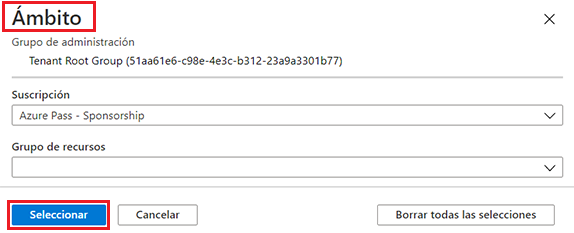
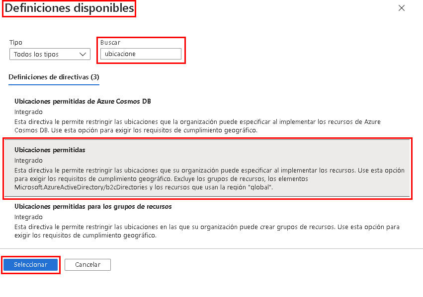
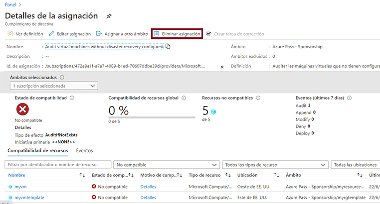

---
wts:
  title: "17: Crear una directiva de Azure (10\_minutos)"
  module: 'Module 05: Describe identity, governance, privacy, and compliance features'
---
# 17: Crear una directiva de Azure (10 minutos)

En este tutorial crearemos una directiva de Azure para restringir la implementación de los recursos de Azure a una ubicación específica.

# Tarea 1: Crear una asignación de directiva 

En esta tarea, configuraremos la directiva de ubicación permitida y la asignaremos a nuestra suscripción. 

1. Inicie sesión en [Azure Portal](https://portal.azure.com).

2. From the <bpt id="p1">**</bpt>All services<ept id="p1">**</ept> blade, search for and select <bpt id="p2">**</bpt>Policy<ept id="p2">**</ept>, under the <bpt id="p3">**</bpt>Authoring<ept id="p3">**</ept> section click <bpt id="p4">**</bpt>Definitions<ept id="p4">**</ept>.  Take a moment to review the list of built-in policy definitions. For example, in the <bpt id="p1">**</bpt>Category<ept id="p1">**</ept> drop-down select only <bpt id="p2">**</bpt>Compute<ept id="p2">**</ept>. Notice the <bpt id="p1">**</bpt>Allowed virtual machine size SKUs<ept id="p1">**</ept> definition enables you to specify a set of virtual machine SKUs that your organization can deploy.

3. Return to the <bpt id="p1">**</bpt>Policy<ept id="p1">**</ept> page, under the <bpt id="p2">**</bpt>Authoring<ept id="p2">**</ept> section click <bpt id="p3">**</bpt>Assignments<ept id="p3">**</ept>. An assignment is a policy that has been assigned to take place within a specific scope. For example, a definition could be assigned to the subscription scope. 

4. Haga clic en **Asignar directiva** en la parte superior de la página **Directiva: Asignaciones**.

5. En la página **Asignar directiva**, mantenga el ámbito predeterminado.

      | Configuración | Valor | 
    | --- | --- |
    | Ámbito| **Utilizar los valores predeterminados**|
    | Definición de directiva | Haga clic en los puntos suspensivos, después busque **Ubicaciones permitidas** y luego **Seleccionar** |
    | Nombre de asignación | **Ubicaciones permitidas** |
    
    
6. On the <bpt id="p1">**</bpt>Parameters<ept id="p1">**</ept> tab, select <bpt id="p2">**</bpt>Japan West<ept id="p2">**</ept>. Click <bpt id="p1">**</bpt>Review + create<ept id="p1">**</ept>, and then <bpt id="p2">**</bpt>Create<ept id="p2">**</ept>.

    <bpt id="p1">**</bpt>Note<ept id="p1">**</ept>: A scope determines what resources or grouping of resources the policy assignment applies to. In our case we could assign this policy to a specific resource group, however we chose to assign the policy at subscription level. Be aware that resources can be excluded based on the scope configuration. Exclusions are optional.

    <bpt id="p1">**</bpt>Note<ept id="p1">**</ept>: This <bpt id="p2">**</bpt>Allowed Locations<ept id="p2">**</ept> policy definition will specify a location into which all resources must be deployed. If a different location is chosen, deployment will not be allowed. For more information view the <bpt id="p1">[</bpt>Azure Policy Samples<ept id="p1">](https://docs.microsoft.com/en-us/azure/governance/policy/samples/index)</ept> page.

   

9. La asignación de directiva de **Ubicaciones permitidas** ahora aparece en el panel **Directiva: Asignaciones** y está implementada, por lo que aplica la directiva en el nivel de ámbito que especificamos (nivel de suscripción).

# Tarea 2: Probar la directiva de Ubicación permitida

En esta tarea probaremos la directiva de Ubicación permitida. 

1. En Azure Portal, desde la hoja **Todos los servicios**, busque y seleccione **Cuentas de almacenamiento** y luego haga clic en **+ Crear**.

2. Configure the storage account (replace <bpt id="p1">**</bpt>xxxx<ept id="p1">**</ept> in the name of the storage account with letters and digits such that the name is globally unique). Leave the defaults for everything else. 

    | Configuración | Value | 
    | --- | --- |
    | Subscription | **Usar los valores predeterminados** |
    | Grupo de recursos | **myRGPolicy** (crear nuevo) |
    | Nombre de la cuenta de almacenamiento | **storageaccountxxxx** |
    | Location | **(EE. UU.) Este de EE. UU.** |

3. Haga clic en **Revisar y crear** y, a continuación, en **Crear**. 

4. Recibirá el mensaje **Error en la implementación** que indica que la directiva desautorizó el recurso, incluido el nombre de la directiva **Ubicaciones permitidas**.

# Tarea 3: Eliminación de la asignación de directiva

En esta tarea, quitaremos la asignación y prueba de la directiva de ubicación permitida. 

Eliminaremos la asignación de directivas para asegurarnos de que no quedemos bloqueados para ningún trabajo futuro que deseemos hacer.

1. Desde la hoja **Todos los servicios**, busque y seleccione **Directiva** y luego haga clic en la directiva **Ubicaciones permitidas**.

    **Nota**: En la hoja **Directiva** puede ver el estado de cumplimiento de las diversas directivas que ha asignado.

    <bpt id="p1">**</bpt>Note<ept id="p1">**</ept>: The Allowed location policy may show non-compliant resources. If so, these are resources created prior to the policy assignment.
 
2. Haga clic en **Ubicaciones permitidas**. Se abrirá la ventana Cumplimiento de directiva de Ubicaciones permitidas.

3. Desde la hoja **Todos los servicios**, busque y seleccione **Directiva**, bajo la sección **Creación**, haga clic en **Definiciones**.

   

4. Trate de crear otra cuenta de almacenamiento para asegurarse de que la directiva ya no está vigente.

    **Nota**: Entre las situaciones comunes donde la directiva de **Ubicaciones permitidas** puede ser útil se incluyen las siguientes: 
    - Tómese un momento para revisar la lista de definiciones de las directivas integradas. 
    - *Cumplimiento de Seguridad y residencia de datos*: También podría tener requisitos de residencia de datos, crear suscripciones por cliente o carga de trabajo específica y definir que todos los recursos deban implementarse en un centro de datos particular para garantizar los requisitos de cumplimiento de seguridad y datos.

Por ejemplo, en el menú desplegable **Categoría** seleccione solo **Calcular**.

Tenga en cuenta que la definición **SKU de máquina virtual permitidas** le permite especificar un conjunto de SKU de máquinas virtuales que su organización puede implementar.
