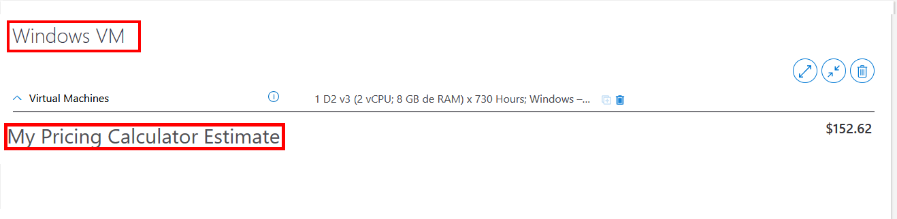
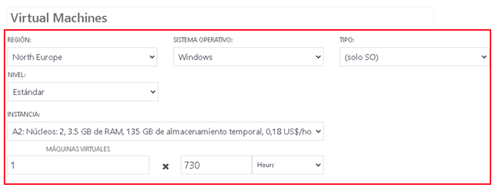
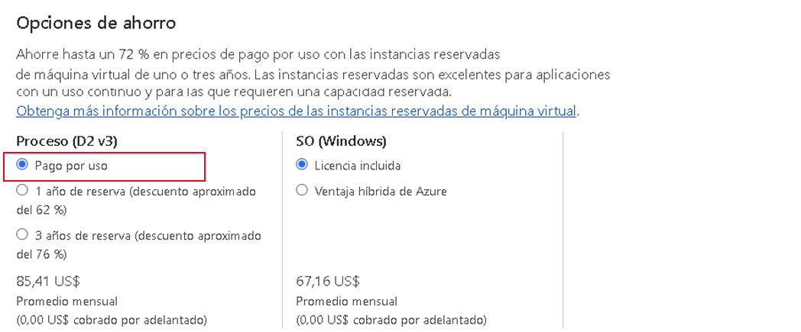
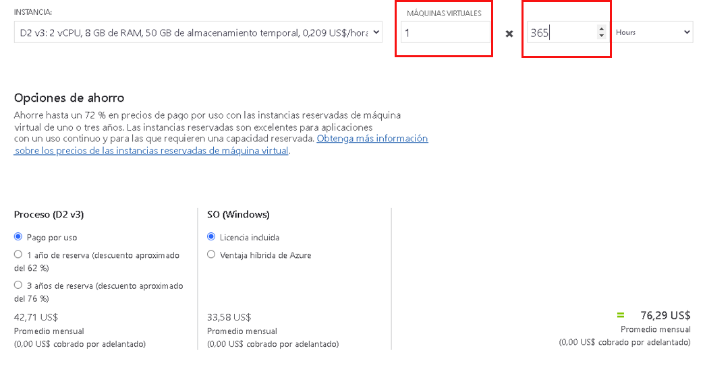
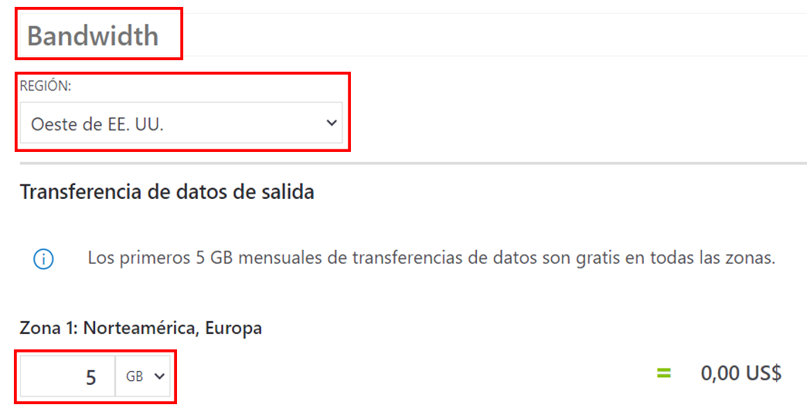
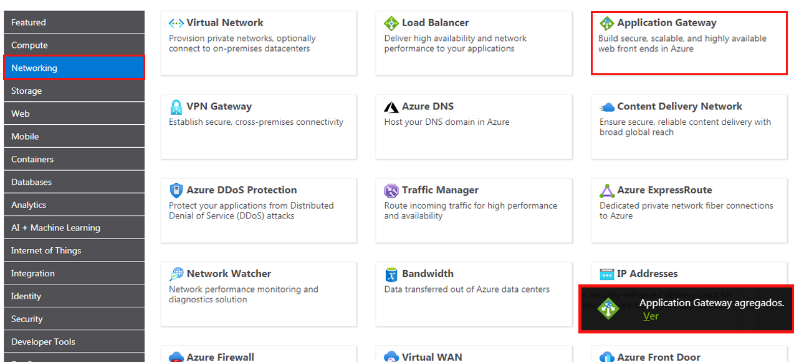
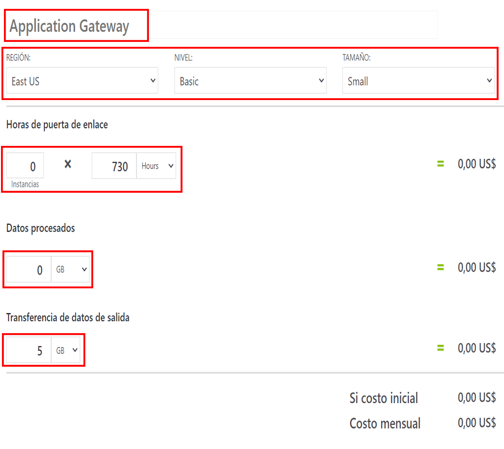
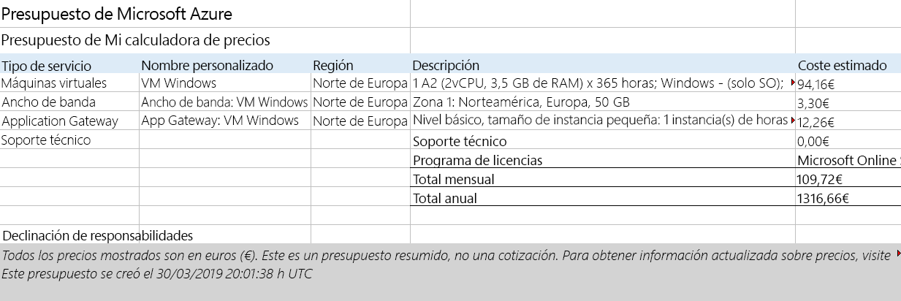

---
wts:
  title: '19: Usar la calculadora de precios de Azure (10 min)'
  module: 'Module 06: Describe Azure cost management and service level agreements'
---
# 19: Usar la calculadora de precios (10 min)

En este tutorial, utilizaremos la calculadora de precios de Azure para generar una estimación de costes para una máquina virtual de Azure y los recursos de red relacionados.

# Tarea 1: Configurar la calculadora de precios

En esta tarea, calcularemos el coste de una infraestructura de muestra con la Calculadora de precios de Azure. 

<bpt id="p1">**</bpt>Note<ept id="p1">**</ept>: To create an Azure Pricing Calculator estimate, this walkthrough provides example configurations for the VM and related resources. Use this example configurations or provide the Azure Pricing Calculator with details of your <bpt id="p1">*</bpt>actual<ept id="p1">*</ept> resource requirements instead.

1. En el explorador, navegue hasta la página web [Calculadora de precios de Azure](https://azure.microsoft.com/en-us/pricing/calculator/).

2. Para agregar detalles de la configuración de su VM, haga clic en **Maquinas virtuales** en la pestaña **Productos**. Desplácese hacia abajo para ver los detalles de la máquina virtual. 

3. Replace <bpt id="p1">**</bpt>Your Estimate<ept id="p1">**</ept> and <bpt id="p2">**</bpt>Virtual Machines<ept id="p2">**</ept> text with more descriptive names for your Azure Pricing Calculator estimate and your VM configuration. This walkthrough example uses <bpt id="p1">**</bpt>My Pricing Calculator Estimate<ept id="p1">**</ept> for the estimate, and <bpt id="p2">**</bpt>Windows VM<ept id="p2">**</ept> for the VM configuration.

   

4. Modifique la configuración de VM predeterminada.

    | Configuración | Value |
    | -- | -- |
    | Region | **Norte de Europa** |
    | Sistema operativo | **Windows** |
    | Tipo | **(Solo para sistema operativo)** |
    | Nivel | **Estándar** |  
    | Instancia | **A2: 2 núcleos, 3,5 GB de RAM, 135 GB de almacenamiento temporal** |

   

    <bpt id="p1">**</bpt>Note<ept id="p1">**</ept>: The VM instance specifications and pricing may differ from those in this example. Follow this walkthrough by choosing an instance that matches the example as closely as possible. To view details about the different VM product options, choose <bpt id="p1">**</bpt>Product details<ept id="p1">**</ept> from the <bpt id="p2">**</bpt>More info<ept id="p2">**</ept> menu on the right.

5. Ajuste la **Opción de facturación** en **Pago por uso**.

   

6. **Nota**: Para crear una estimación de la Calculadora de precios de Azure, este tutorial ofrece configuraciones de ejemplo para la VM y recursos relacionados.

    Deje el número de máquinas virtuales establecido en `1` y cambie el valor de las horas por mes a `365`.

   

7. En el panel **Discos de sistema operativo administrados**, modifique la configuración del almacenamiento de VM predeterminada.

    | Nivel | Tamaño del disco | Número de discos | Depurador de | Transacciones de almacenamiento |
    | ---- | --------- | --------------- | -------- | -------------------- |
    | HDD estándar | S30: 1 024 GiB | 1 | Desactivado | 10 000 |

   

8. To add networking bandwidth to your estimate, go to the top of the Azure Pricing Calculator webpage. Click <bpt id="p1">**</bpt>Networking<ept id="p1">**</ept> in the product menu on the left, then click the <bpt id="p2">**</bpt>Bandwidth<ept id="p2">**</ept> tile. In the <bpt id="p1">**</bpt>Bandwidth added<ept id="p1">**</ept> message dialog, click <bpt id="p2">**</bpt>View<ept id="p2">**</ept>.

   

9. Reemplace el texto **Su estimación** y **Virtual Machines** por nombres más descriptivos de su estimación de la Calculadora de precios de Azure y de la configuración de su máquina virtual.

    | Region | Cantidad de transferencia de datos salientes de la Zona 1 |
    | ------ | -------------------------------------- |
    | Norte de Europa | 50 GB |

   

10. To add an Application Gateway, return to the top of the Azure Pricing Calculator webpage. In the <bpt id="p1">**</bpt>Networking<ept id="p1">**</ept> product menu, click the <bpt id="p2">**</bpt>Application Gateway<ept id="p2">**</ept> tile. In the <bpt id="p1">**</bpt>Application Gateway<ept id="p1">**</ept> message dialog, click <bpt id="p2">**</bpt>View<ept id="p2">**</ept>.

    

11. El nombre de la estimación y el nombre de la configuración de VM resaltados indican cómo agregar un nombre de estimación y un nombre de configuración de VM a una estimación de la calculadora de precios de Azure.

    | Configuración | Value |
    | -- | -- |
    | Region | **Norte de Europa** |
    | Nivel | **Basic** |
    | Size | **Pequeño** |
    | Instancias | **1** |  
    | Horas | **365** |
    | Datos procesados | **50 GB** |
    | Zona 1: Norteamérica, Europa | **50 GB**|

    

# Tarea 2: Revisar el presupuesto de precios

En esta tarea, revisaremos los resultados de la Calculadora de precios de Azure. 

1. Desplácese hasta la parte inferior de la página web de la Calculadora de precios de Azure para ver el **Coste mensual estimado** total.

    <bpt id="p1">**</bpt>Note<ept id="p1">**</ept>: Explore the various options available within the Azure Pricing Calculator. For example, this walkthrough requires you to update the currency to Euro.

2. Cambie la divisa a euro y luego seleccione **Exportar** para descargar una copia de la estimación y así poder verla sin conexión en formato Microsoft Excel (`.xlsx`).

    

    

Congratulations! You downloaded an estimate from the Azure Pricing Calculator.
